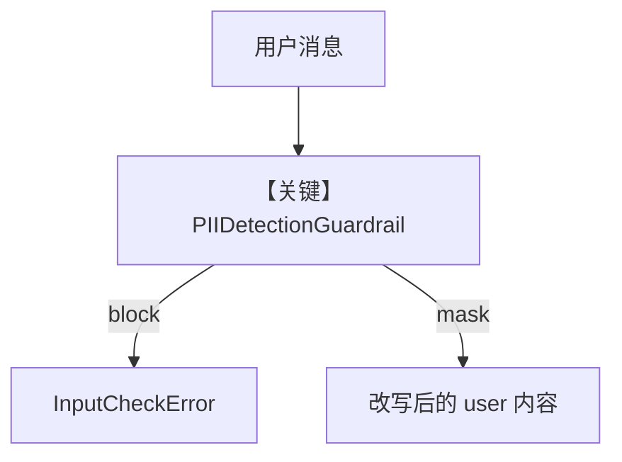

# pii_detection.py — 实现原理分析

> 源文件：`cookbook/03_teams/18_guardrails/pii_detection.py`

## 概述

本示例展示 **`PIIDetectionGuardrail`**：`blocking_team` 检测到 PII 则拒绝；`masked_team` 传 `mask_pii=True` 时对输入脱敏后继续。

**核心配置一览：**

| 配置项 | blocking_team | masked_team |
|--------|---------------|-------------|
| `pre_hooks` | `[PIIDetectionGuardrail()]` | `[PIIDetectionGuardrail(mask_pii=True)]` |

## 运行机制与因果链

与 OpenAI moderation 相同：**pre_hook 先于** `get_run_messages`；脱敏路径会改写进入模型的用户文本。

## System Prompt 组装

`instructions` 字面：

```text
You are a helpful customer service assistant. Always protect user privacy and handle sensitive information appropriately.
```

## Mermaid 流程图


```mermaid
flowchart TD
    U["用户消息"] --> P["【关键】PIIDetectionGuardrail"]
    P -->|block| E["InputCheckError"]
    P -->|mask| N["改写后的 user 内容"]
```

## 关键源码文件索引

| 文件 | 作用 |
|------|------|
| `agno/guardrails/` | `PIIDetectionGuardrail` |
