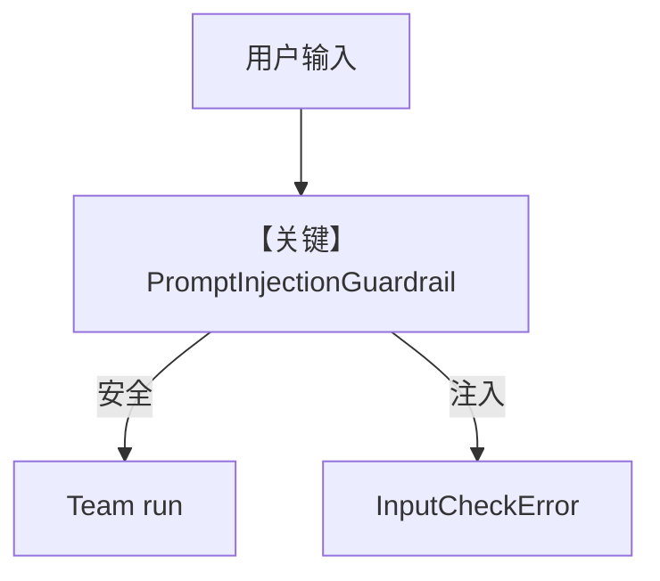

# prompt_injection.py — 实现原理分析

> 源文件：`cookbook/03_teams/18_guardrails/prompt_injection.py`

## 概述

本示例展示 **`PromptInjectionGuardrail`**：在 Team 运行前检测越狱/忽略指令类输入，命中则 `InputCheckError`。

**核心配置一览：**

| 配置项 | 值 |
|--------|-----|
| `pre_hooks` | `[PromptInjectionGuardrail()]` |
| `description` / `instructions` | 笑话助手人设（L21-22） |

## System Prompt 组装

### 还原后的完整 System 相关文案（来自 instructions）

```text
You are a friendly assistant that tells jokes and provides helpful information. Always maintain a positive and helpful tone.
```

## Mermaid 流程图


```mermaid
flowchart TD
    I["用户输入"] --> J["【关键】PromptInjectionGuardrail"]
    J -->|安全| T["Team run"]
    J -->|注入| B["InputCheckError"]
```

## 关键源码文件索引

| 文件 | 作用 |
|------|------|
| `agno/guardrails/` | `PromptInjectionGuardrail` |
