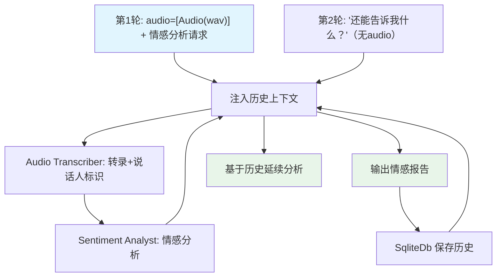

# audio_sentiment_analysis.py — 实现原理分析

> 源文件：`cookbook/03_teams/19_multimodal/audio_sentiment_analysis.py`

## 概述

本示例展示 **带会话历史的音频情感分析 Team**：第一轮传入 WAV 音频做情感分析，第二轮纯文本追问——因配置了 `add_history_to_context=True` 和 `SqliteDb`，Team 能记住第一轮的音频分析结果并在第二轮中延续上下文。

**核心配置一览：**

| 配置项 | 值 | 说明 |
|--------|------|------|
| 模型 | `Gemini(id="gemini-3-flash-preview")` | 音频支持 |
| `add_history_to_context` | `True` | 历史注入上下文 |
| `db` | `SqliteDb(...)` | 持久化会话历史 |
| 第一轮 | `audio=[Audio(content=bytes)]` | 音频输入 |
| 第二轮 | 纯文本追问 | 依赖历史上下文 |

## 核心组件解析

### 多轮音频会话

```python
# 第一轮：音频分析
sentiment_team.print_response(
    "Give a sentiment analysis of this audio...",
    audio=[Audio(content=audio_content)],
    stream=True,
)

# 第二轮：纯文本追问（依赖历史）
sentiment_team.print_response(
    "What else can you tell me about this audio conversation?",
    stream=True,  # 无需再次传入 audio
)
```

第二轮能回答"这段音频"是因为历史中保存了第一轮的转录和分析结果。

### 两成员分工

```
Audio Transcriber → 转录音频，标识说话人 A/B
Sentiment Analyst → 分析每位说话人的情感，识别情绪模式
```

### SQLite 持久化

```python
db=SqliteDb(
    session_table="audio_sentiment_team_sessions",
    db_file="tmp/audio_sentiment_team.db",
)
```

历史持久化在本地 SQLite，重启程序后同一 session_id 仍可延续对话。

## Mermaid 流程图



## 关键源码文件索引

| 文件 | 关键函数/类 | 作用 |
|------|------------|------|
| `agno/media/__init__.py` | `Audio` | 音频媒体对象 |
| `agno/db/sqlite.py` | `SqliteDb` | SQLite 会话存储 |
