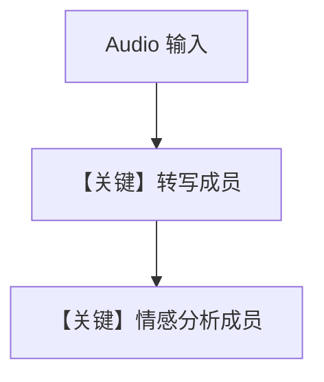

# audio_sentiment_analysis.py — 实现原理分析

> 源文件：`cookbook/03_teams/19_multimodal/audio_sentiment_analysis.py`

## 概述

本示例展示 **Team 处理音频：转写 + 情感分析** 流水线，使用 `Audio` 媒体对象与成员分工；常配合 `SqliteDb` 会话（见源码）持久化。

**核心配置一览：** 以 `.py` 为准——`Audio` 附件、`Team`/`Agent` 模型（可能含 Gemini/OpenAI）、`instructions` 定义先转写再 NLP 分析。

## 运行机制与因果链

1. **路径**：音频 URL 或文件 → 装入 `RunMessages` 的 media 段 → 成员依次处理。
2. **关键**：多模态输入经 `get_run_messages` / 模型适配器转为厂商-specific 字段（如 Gemini `audio` parts）。

## System Prompt 组装

Team 默认 system + 成员角色；**无单一静态 system 字串**可脱离媒体描述，须结合 `agno/team/_messages.py` 中 `attached_media` 段（L274-286）。

## 完整 API 请求

若成员使用 **Gemini**：走 `Google` 模型 `invoke`；若 **OpenAI**：可能为 audio 预览 API 或转写端点——以具体 `Model` 子类为准。

## Mermaid 流程图

```mermaid
flowchart TD
    A["Audio 输入"] --> T["【关键】转写成员"]
    T --> S["【关键】情感分析成员"]
```

## 关键源码文件索引

| 文件 | 作用 |
|------|------|
| `agno/media/` | `Audio` |
| `agno/team/_messages.py` | `attached_media` |
