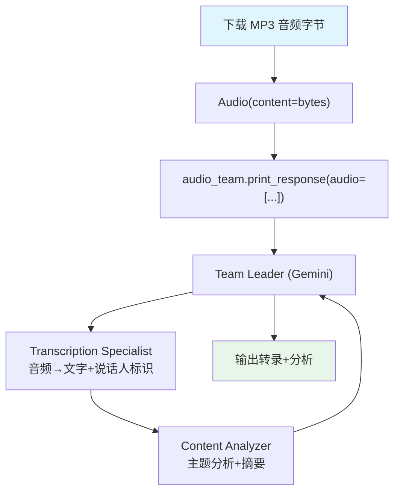

# audio_to_text.py — 实现原理分析

> 源文件：`cookbook/03_teams/19_multimodal/audio_to_text.py`

## 概述

本示例展示 **多模态音频输入的 Team**：使用 Gemini 模型（原生支持音频理解），将 MP3 音频字节通过 `Audio(content=...)` 传入 Team。Transcription Specialist 将音频转为带说话人标识的文本，Content Analyzer 分析关键主题。

**核心配置一览：**

| 配置项 | 值 | 说明 |
|--------|------|------|
| 模型 | `Gemini(id="gemini-3-flash-preview")` | 支持音频的多模态模型 |
| 媒体输入 | `audio=[Audio(content=bytes)]` | 传入原始音频字节 |

## 核心组件解析

### 音频媒体传入方式

```python
response = requests.get(url)
audio_content = response.content  # 下载 MP3 字节

audio_team.print_response(
    "Give a transcript of this audio...",
    audio=[Audio(content=audio_content)],  # 传入音频
    stream=True,
)
```

`Audio` 对象支持 `content`（字节）和 `url` 两种形式。

### 两成员分工

```
Transcription Specialist → 音频转文字，标识 Speaker A/B
Content Analyzer         → 分析关键主题，提供摘要
```

### 模型选择的重要性

Gemini 原生支持音频理解，可直接处理 MP3/WAV 内容。OpenAI GPT 模型需要先用 Whisper 转录，再处理文本。

## Mermaid 流程图



## 关键源码文件索引

| 文件 | 关键函数/类 | 作用 |
|------|------------|------|
| `agno/media/__init__.py` | `Audio` | 音频媒体对象 |
| `agno/models/google/gemini.py` | `Gemini` | 多模态 Gemini 模型 |
