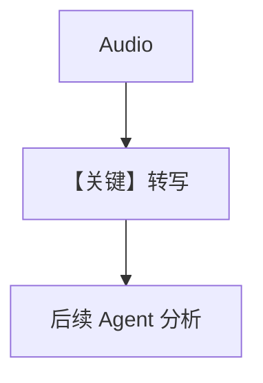

# audio_to_text.py — 实现原理分析

> 源文件：`cookbook/03_teams/19_multimodal/audio_to_text.py`

## 概述

本示例展示 **团队级音频转写 + 后续文本分析**：使用 `Audio` 与 **Gemini** 等支持音频的模型，成员之一专注转写，另一成员基于转写稿作答。

## 运行机制与因果链

媒体随 user run 传入；`_get_user_message` / 异步版将 `audio` 合并进消息，供模型适配器编码。

## System Prompt 组装

默认 Team；转写质量依赖模型多模态能力与 `instructions`。

## Mermaid 流程图

```mermaid
flowchart TD
    Au["Audio"] --> Tr["【关键】转写"]
    Tr --> F["后续 Agent 分析"]
```

## 关键源码文件索引

| 文件 | 作用 |
|------|------|
| `agno/models/google/` | Gemini 多模态 |
