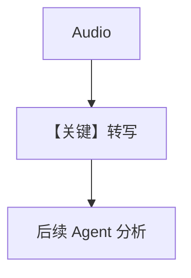

# audio_to_text.py — 实现原理分析

<!-- cookbook-py-source:start -->
## 完整源码

```python
"""
Audio To Text
=============================

Demonstrates team-based audio transcription and follow-up content analysis.
"""

import requests
from agno.agent import Agent
from agno.media import Audio
from agno.models.google import Gemini
from agno.team import Team

# ---------------------------------------------------------------------------
# Create Members
# ---------------------------------------------------------------------------
transcription_specialist = Agent(
    name="Transcription Specialist",
    role="Convert audio to accurate text transcriptions",
    model=Gemini(id="gemini-3-flash-preview"),
    instructions=[
        "Transcribe audio with high accuracy",
        "Identify speakers clearly as Speaker A, Speaker B, etc.",
        "Maintain conversation flow and context",
    ],
)

content_analyzer = Agent(
    name="Content Analyzer",
    role="Analyze transcribed content for insights",
    model=Gemini(id="gemini-3-flash-preview"),
    instructions=[
        "Analyze transcription for key themes and insights",
        "Provide summaries and extract important information",
    ],
)

# ---------------------------------------------------------------------------
# Create Team
# ---------------------------------------------------------------------------
audio_team = Team(
    name="Audio Analysis Team",
    model=Gemini(id="gemini-3-flash-preview"),
    members=[transcription_specialist, content_analyzer],
    instructions=[
        "Work together to transcribe and analyze audio content.",
        "Transcription Specialist: First convert audio to accurate text with speaker identification.",
        "Content Analyzer: Analyze transcription for insights and key themes.",
    ],
    markdown=True,
)

# ---------------------------------------------------------------------------
# Run Team
# ---------------------------------------------------------------------------
if __name__ == "__main__":
    url = "https://agno-public.s3.us-east-1.amazonaws.com/demo_data/QA-01.mp3"
    response = requests.get(url)
    audio_content = response.content

    audio_team.print_response(
        "Give a transcript of this audio conversation. Use speaker A, speaker B to identify speakers.",
        audio=[Audio(content=audio_content)],
        stream=True,
    )
```

<!-- cookbook-py-source:end -->

> 源文件：`cookbook/03_teams/19_multimodal/audio_to_text.py`

## 概述

本示例展示 **团队级音频转写 + 后续文本分析**：使用 `Audio` 与 **Gemini** 等支持音频的模型，成员之一专注转写，另一成员基于转写稿作答。

## 运行机制与因果链

媒体随 user run 传入；`_get_user_message` / 异步版将 `audio` 合并进消息，供模型适配器编码。

## System Prompt 组装

默认 Team；转写质量依赖模型多模态能力与 `instructions`。

## Mermaid 流程图


```mermaid
flowchart TD
    Au["Audio"] --> Tr["【关键】转写"]
    Tr --> F["后续 Agent 分析"]
```

## 关键源码文件索引

| 文件 | 作用 |
|------|------|
| `agno/models/google/` | Gemini 多模态 |
