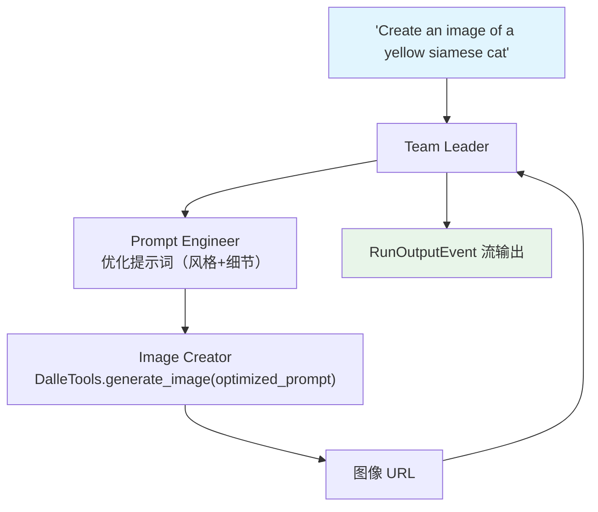

# generate_image_with_team.py — 实现原理分析

> 源文件：`cookbook/03_teams/19_multimodal/generate_image_with_team.py`

## 概述

本示例展示 **DALL-E 图像生成 Team**：Prompt Engineer 优化用户原始提示词，Image Creator 使用 `DalleTools` 调用 DALL-E 生成图像。使用 `run(stream=True, stream_events=True)` 获取细粒度事件流，并以 `dataclass_to_dict` 序列化每个事件（排除 `messages` 字段）打印。

**核心配置一览：**

| 配置项 | 值 | 说明 |
|--------|------|------|
| 图像生成工具 | `DalleTools()` | OpenAI DALL-E 调用 |
| 运行方式 | `run(stream=True, stream_events=True)` | 事件流 |
| 返回类型 | `Iterator[RunOutputEvent]` | 可迭代事件流 |

## 核心组件解析

### 两成员分工

```
Prompt Engineer → 优化原始提示词（艺术风格、构图、技术细节）
Image Creator  → 调用 DalleTools 生成图像，返回  格式
```

### 事件流消费

```python
run_stream: Iterator[RunOutputEvent] = image_team.run(
    "Create an image of a yellow siamese cat",
    stream=True,
    stream_events=True,
)
for chunk in run_stream:
    pprint(dataclass_to_dict(chunk, exclude={"messages"}))
    print("---" * 20)
```

`stream_events=True` 返回 `RunOutputEvent` 对象（包含 event 类型、内容、工具调用等），`dataclass_to_dict` 将其序列化为可打印的字典。

### Prompt 优化的价值

直接将用户的简短提示送给 DALL-E 往往效果一般。Prompt Engineer 先扩展提示词，加入艺术风格、光线、细节描述，再由 Image Creator 调用，显著提升生成质量。

## Mermaid 流程图



## 关键源码文件索引

| 文件 | 关键函数/类 | 作用 |
|------|------------|------|
| `agno/tools/dalle.py` | `DalleTools` | DALL-E 图像生成工具 |
| `agno/utils/common.py` | `dataclass_to_dict` | 序列化工具 |
