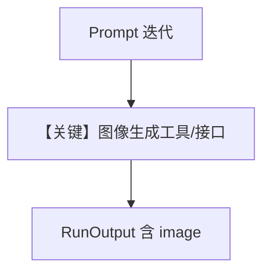

# generate_image_with_team.py — 实现原理分析

> 源文件：`cookbook/03_teams/19_multimodal/generate_image_with_team.py`

## 概述

本示例展示 **Team 协作优化文生图提示词并调用 DALL·E（或同类）生成图片**：成员分别承担「创意/约束/终稿 prompt」角色，队长协调；可能演示 **流式事件** `RunOutputEvent`。

## 运行机制与因果链

图像生成通常以 **工具调用** 或专用模型方法完成，输出落在 `RunOutput` 的媒体字段；需有效 OpenAI 图像 API 权限。

## Mermaid 流程图

```mermaid
flowchart TD
    P["Prompt 迭代"] --> G["【关键】图像生成工具/接口"]
    G --> O["RunOutput 含 image"]
```

## 关键源码文件索引

| 文件 | 作用 |
|------|------|
| `agno/models/openai/` | 图像相关 API |
