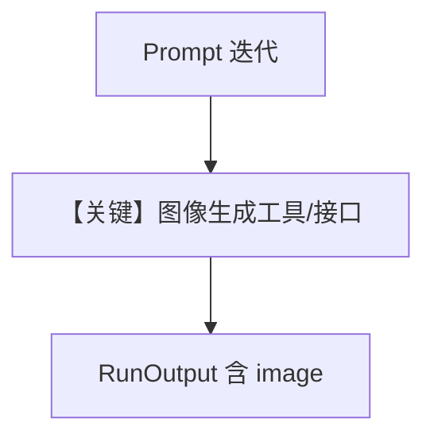

# generate_image_with_team.py — 实现原理分析

<!-- cookbook-py-source:start -->
## 完整源码

```python
"""
Generate Image With Team
========================

Demonstrates collaborative prompt optimization and DALL-E image generation.
"""

from typing import Iterator

from agno.agent import Agent, RunOutputEvent
from agno.models.openai import OpenAIResponses
from agno.team import Team
from agno.tools.dalle import DalleTools
from agno.utils.common import dataclass_to_dict
from rich.pretty import pprint

# ---------------------------------------------------------------------------
# Create Members
# ---------------------------------------------------------------------------
image_generator = Agent(
    name="Image Creator",
    role="Generate images using DALL-E",
    model=OpenAIResponses(id="gpt-5.2"),
    tools=[DalleTools()],
    instructions=[
        "Use the DALL-E tool to create high-quality images",
        "Return image URLs in markdown format: ``",
    ],
)

prompt_engineer = Agent(
    name="Prompt Engineer",
    role="Optimize and enhance image generation prompts",
    model=OpenAIResponses(id="gpt-5.2"),
    instructions=[
        "Enhance user prompts for better image generation results",
        "Consider artistic style, composition, and technical details",
    ],
)

# ---------------------------------------------------------------------------
# Create Team
# ---------------------------------------------------------------------------
image_team = Team(
    name="Image Generation Team",
    model=OpenAIResponses(id="gpt-5.2"),
    members=[prompt_engineer, image_generator],
    instructions=[
        "Generate high-quality images from user prompts.",
        "Prompt Engineer: First enhance and optimize the user's prompt.",
        "Image Creator: Generate images using the enhanced prompt with DALL-E.",
    ],
    markdown=True,
)

# ---------------------------------------------------------------------------
# Run Team
# ---------------------------------------------------------------------------
if __name__ == "__main__":
    run_stream: Iterator[RunOutputEvent] = image_team.run(
        "Create an image of a yellow siamese cat",
        stream=True,
        stream_events=True,
    )
    for chunk in run_stream:
        pprint(dataclass_to_dict(chunk, exclude={"messages"}))
        print("---" * 20)
```

<!-- cookbook-py-source:end -->

> 源文件：`cookbook/03_teams/19_multimodal/generate_image_with_team.py`

## 概述

本示例展示 **Team 协作优化文生图提示词并调用 DALL·E（或同类）生成图片**：成员分别承担「创意/约束/终稿 prompt」角色，队长协调；可能演示 **流式事件** `RunOutputEvent`。

## 运行机制与因果链

图像生成通常以 **工具调用** 或专用模型方法完成，输出落在 `RunOutput` 的媒体字段；需有效 OpenAI 图像 API 权限。

## Mermaid 流程图


```mermaid
flowchart TD
    P["Prompt 迭代"] --> G["【关键】图像生成工具/接口"]
    G --> O["RunOutput 含 image"]
```

## 关键源码文件索引

| 文件 | 作用 |
|------|------|
| `agno/models/openai/` | 图像相关 API |
