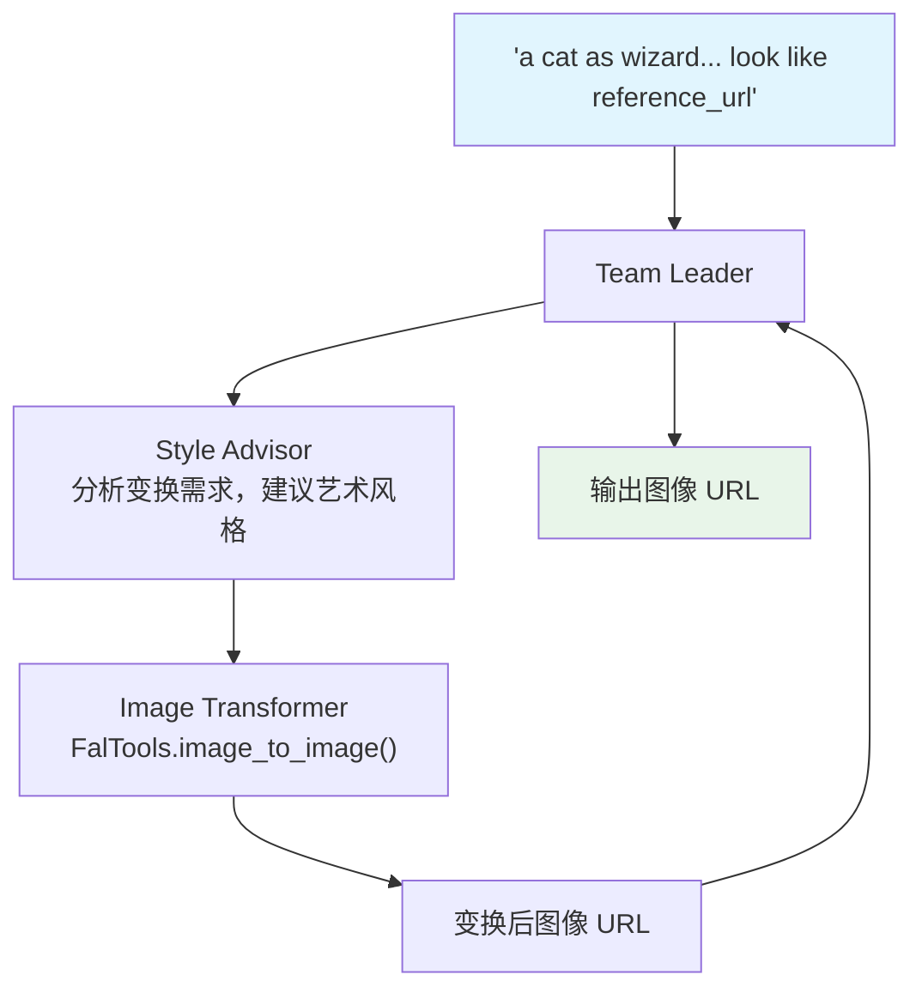

# image_to_image_transformation.py — 实现原理分析

> 源文件：`cookbook/03_teams/19_multimodal/image_to_image_transformation.py`

## 概述

本示例展示 **图像风格迁移 Team**：Style Advisor 分析用户的图像变换需求并给出艺术风格建议，Image Transformer 使用 `FalTools` 的 `image_to_image` 工具实际生成变换后的图像。用户只需提供参考图 URL 和变换描述，Team 自动协调完成。

**核心配置一览：**

| 配置项 | 值 | 说明 |
|--------|------|------|
| 图像生成工具 | `FalTools()` | Fal.ai 图像变换 API |
| Style Advisor | 无工具 | 纯 LLM 风格分析 |
| Image Transformer | `FalTools` | 调用 `image_to_image` |

## 核心组件解析

### 两成员分工

```
Style Advisor     → 分析变换需求，建议艺术风格、构图、光线处理
Image Transformer → 调用 FalTools.image_to_image() 生成变换结果
```

### Fal.ai 工具集成

```python
image_transformer = Agent(
    tools=[FalTools()],
    instructions=[
        "Use the `image_to_image` tool to generate transformed images",
        "Return the image URL as provided without markdown conversion",
    ],
)
```

`FalTools` 封装了 Fal.ai 的图像生成和变换 API，提供 `image_to_image` 工具函数。

### 输入格式

```python
transformation_team.print_response(
    "a cat dressed as a wizard... Make it look like 'https://fal.media/files/...png'",
    stream=True,
)
```

用户通过自然语言描述目标效果，并提供参考图 URL，Style Advisor 解析后传给 Image Transformer 执行。

## Mermaid 流程图



## 关键源码文件索引

| 文件 | 关键函数/类 | 作用 |
|------|------------|------|
| `agno/tools/fal.py` | `FalTools` | Fal.ai 图像生成工具 |
