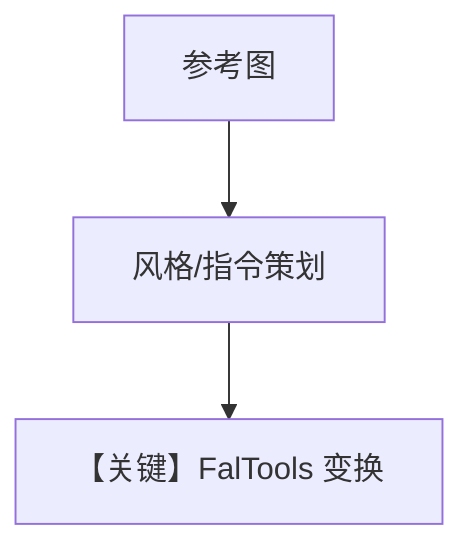

# image_to_image_transformation.py — 实现原理分析

<!-- cookbook-py-source:start -->
## 完整源码

```python
"""
Image To Image Transformation
=============================

Demonstrates collaborative style planning and image transformation.
"""

from agno.agent import Agent
from agno.models.openai import OpenAIResponses
from agno.team import Team
from agno.tools.fal import FalTools

# ---------------------------------------------------------------------------
# Create Members
# ---------------------------------------------------------------------------
style_advisor = Agent(
    name="Style Advisor",
    role="Analyze and recommend artistic styles and transformations",
    model=OpenAIResponses(id="gpt-5.2"),
    instructions=[
        "Analyze the input image and transformation request",
        "Provide style recommendations and enhancement suggestions",
        "Consider artistic elements like composition, lighting, and mood",
    ],
)

image_transformer = Agent(
    name="Image Transformer",
    role="Transform images using AI tools",
    model=OpenAIResponses(id="gpt-5.2"),
    tools=[FalTools()],
    instructions=[
        "Use the `image_to_image` tool to generate transformed images",
        "Apply the recommended styles and transformations",
        "Return the image URL as provided without markdown conversion",
    ],
)

# ---------------------------------------------------------------------------
# Create Team
# ---------------------------------------------------------------------------
transformation_team = Team(
    name="Image Transformation Team",
    model=OpenAIResponses(id="gpt-5.2"),
    members=[style_advisor, image_transformer],
    instructions=[
        "Transform images with artistic style and precision.",
        "Style Advisor: First analyze transformation requirements and recommend styles.",
        "Image Transformer: Apply transformations using AI tools with style guidance.",
    ],
    markdown=True,
)

# ---------------------------------------------------------------------------
# Run Team
# ---------------------------------------------------------------------------
if __name__ == "__main__":
    transformation_team.print_response(
        "a cat dressed as a wizard with a background of a mystic forest. Make it look like 'https://fal.media/files/koala/Chls9L2ZnvuipUTEwlnJC.png'",
        stream=True,
    )
```

<!-- cookbook-py-source:end -->

> 源文件：`cookbook/03_teams/19_multimodal/image_to_image_transformation.py`

## 概述

本示例展示 **`FalTools` 图像变换**：成员分工「风格策划」与「调用 fal 执行 img2img」，体现 Team 与 **外部图像 API** 的组合。

## 运行机制与因果链

输入图经 `Image` 传入；工具将图像引用编码为 fal 请求；队长合成自然语言任务说明。

## Mermaid 流程图


```mermaid
flowchart TD
    I["参考图"] --> Pl["风格/指令策划"]
    Pl --> F["【关键】FalTools 变换"]
```

## 关键源码文件索引

| 文件 | 作用 |
|------|------|
| `agno/tools/fal.py` | `FalTools` |
