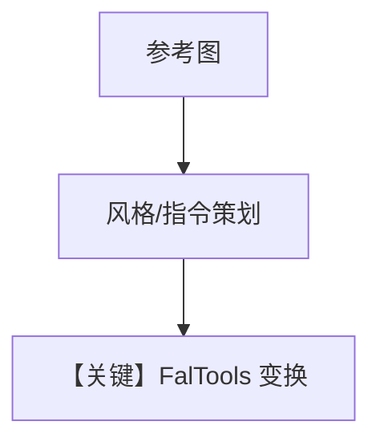

# image_to_image_transformation.py — 实现原理分析

> 源文件：`cookbook/03_teams/19_multimodal/image_to_image_transformation.py`

## 概述

本示例展示 **`FalTools` 图像变换**：成员分工「风格策划」与「调用 fal 执行 img2img」，体现 Team 与 **外部图像 API** 的组合。

## 运行机制与因果链

输入图经 `Image` 传入；工具将图像引用编码为 fal 请求；队长合成自然语言任务说明。

## Mermaid 流程图

```mermaid
flowchart TD
    I["参考图"] --> Pl["风格/指令策划"]
    Pl --> F["【关键】FalTools 变换"]
```

## 关键源码文件索引

| 文件 | 作用 |
|------|------|
| `agno/tools/fal.py` | `FalTools` |
