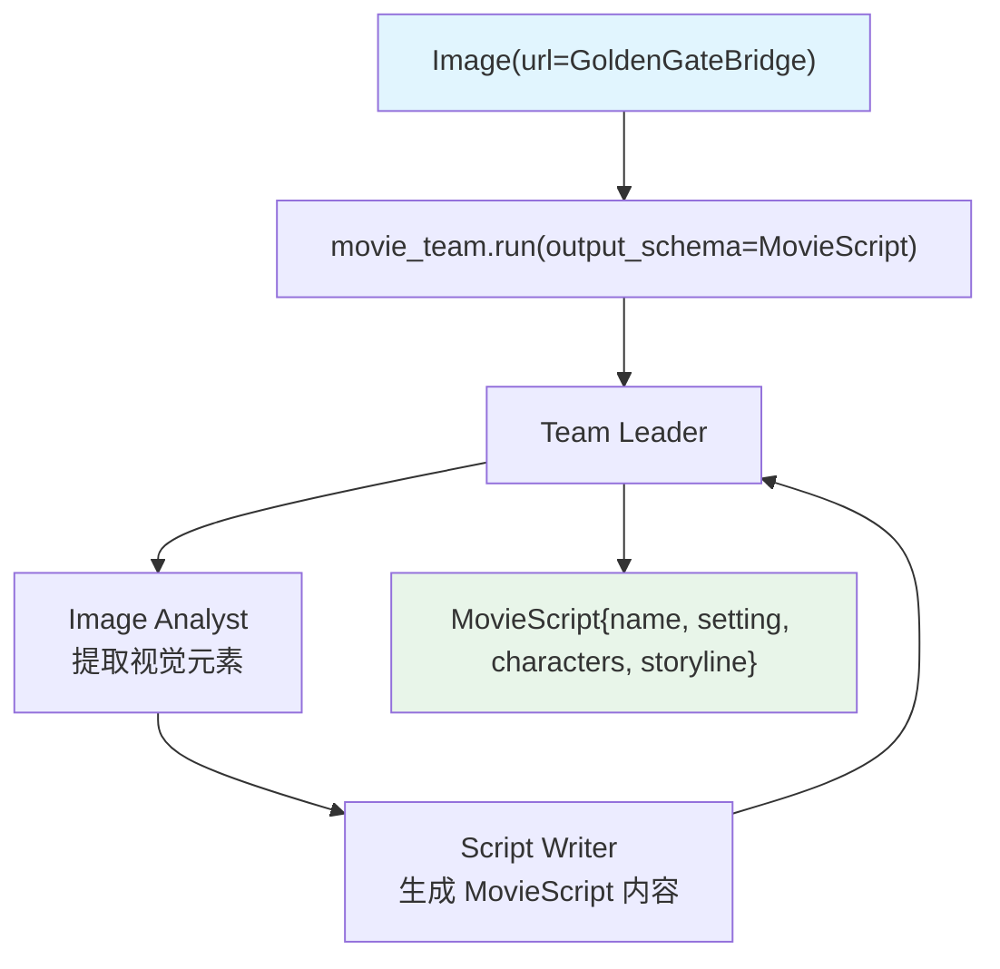

# image_to_structured_output.py — 实现原理分析

> 源文件：`cookbook/03_teams/19_multimodal/image_to_structured_output.py`

## 概述

本示例展示 **图像输入 + Pydantic 结构化输出的多模态 Team**：从图片（金门大桥 URL）生成严格符合 `MovieScript` Pydantic 模型（name、setting、characters、storyline）的电影剧本。`run(stream=True)` 返回事件流，每个 event 的 `content` 字段即 `MovieScript` 实例或其片段。

**核心配置一览：**

| 配置项 | 值 | 说明 |
|--------|------|------|
| 媒体输入 | `images=[Image(url=...)]` | 远程图片 URL |
| `output_schema` | `MovieScript` | Pydantic 结构化输出 |
| 运行方式 | `run(stream=True)` | 流式事件迭代 |

## 核心组件解析

### `MovieScript` Pydantic 模型

```python
class MovieScript(BaseModel):
    name: str = Field(..., description="Give a name to this movie")
    setting: str = Field(..., description="Provide a nice setting...")
    characters: List[str] = Field(..., description="Name of characters...")
    storyline: str = Field(..., description="3 sentence storyline...")
```

### 流式事件读取

```python
response = movie_team.run(
    "Write a movie about this image",
    images=[Image(url="https://...GoldenGateBridge.jpg")],
    stream=True,
)

for event in response:
    pprint(event.content)  # MovieScript 实例或片段
```

### 图像 + 结构化输出的协作

```
Image Analyst → 从图像提取视觉元素（场景、人物、氛围）
Script Writer → 按 MovieScript schema 生成结构化内容
Team Leader  → 通过 output_schema=MovieScript 强制输出格式
```

## Mermaid 流程图



## 关键源码文件索引

| 文件 | 关键函数/类 | 作用 |
|------|------------|------|
| `agno/media/__init__.py` | `Image` | 图像媒体对象 |
| `agno/team/team.py` | `output_schema` | Pydantic 结构化输出 |
