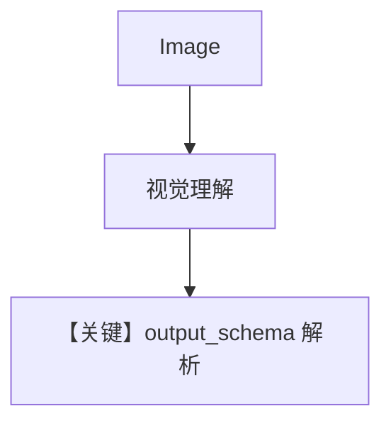

# image_to_structured_output.py — 实现原理分析

> 源文件：`cookbook/03_teams/19_multimodal/image_to_structured_output.py`

## 概述

本示例展示 **视觉理解 + `output_schema` 结构化**（如剧本字段）：一成员读图，另一成员或同成员用 Pydantic 模型输出分字段剧本文案。

## 运行机制与因果链

结构化输出走 Agent/Team 的 `output_schema` 路径时，system 会附加 JSON 约束（见 `agno/team/_messages.py` `_build_trailing_sections` 与 parser 逻辑）。

## Mermaid 流程图

```mermaid
flowchart TD
    Im["Image"] --> V["视觉理解"]
    V --> S["【关键】output_schema 解析"]
```

## 关键源码文件索引

| 文件 | 作用 |
|------|------|
| `agno/team/_messages.py` | JSON / structured 提示 |
