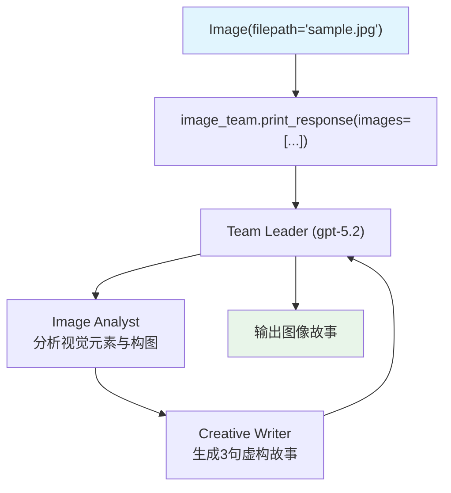

# image_to_text.py — 实现原理分析

> 源文件：`cookbook/03_teams/19_multimodal/image_to_text.py`

## 概述

本示例展示 **图像输入的多模态 Team**：通过 `Image(filepath=...)` 加载本地图片，传入 Team。Image Analyst 详细描述图像视觉元素，Creative Writer 将描述转化为3句虚构故事。展示了图像理解与创意生成的协作分工。

**核心配置一览：**

| 配置项 | 值 | 说明 |
|--------|------|------|
| 模型 | `OpenAIResponses(id="gpt-5.2")` | 支持视觉的多模态模型 |
| 媒体输入 | `images=[Image(filepath=path)]` | 本地图片文件 |

## 核心组件解析

### 图像输入方式

```python
image_path = Path(__file__).parent.joinpath("sample.jpg")
image_team.print_response(
    "Write a 3 sentence fiction story about the image",
    images=[Image(filepath=image_path)],  # 本地文件
)
```

`Image` 支持多种来源：
- `Image(filepath=...)` — 本地文件
- `Image(url=...)` — 远程 URL
- `Image(content=bytes)` — 原始字节

### 两成员分工

```
Image Analyst   → 分析视觉元素、构图、关键细节
Creative Writer → 基于分析生成3句虚构故事
```

### 图像传递给成员

Team Leader 接收图像后，在委托成员时将图像描述（而非原始图像）传递，成员根据 Leader 提供的描述工作。

## Mermaid 流程图



## 关键源码文件索引

| 文件 | 关键函数/类 | 作用 |
|------|------------|------|
| `agno/media/__init__.py` | `Image` | 图像媒体对象 |
