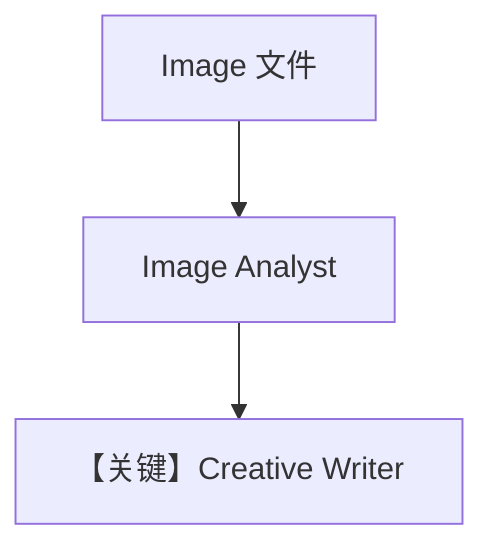

# image_to_text.py — 实现原理分析

> 源文件：`cookbook/03_teams/19_multimodal/image_to_text.py`

## 概述

本示例展示 **图像分析 + 叙事写作** 两成员：`Image` 由路径加载，Image Analyst 产出描述，Creative Writer 再生成故事。

**核心配置一览：** `image_team`，`OpenAIResponses(gpt-5.2)`，成员 `instructions` 见 `.py` L22-35、41-46。

## System Prompt 组装

队长额外 `instructions` 协调二者；媒体在 `<attached_media>` 进入 system（若本 run 带图）。

### 还原（成员 instructions 节选）

见源码 `image_analyzer` / `creative_writer` 的 `instructions` 列表，须原样引用。

## Mermaid 流程图

```mermaid
flowchart TD
    Img["Image 文件"] --> An["Image Analyst"]
    An --> Wr["【关键】Creative Writer"]
```

## 关键源码文件索引

| 文件 | 作用 |
|------|------|
| `agno/media/` | `Image` |
