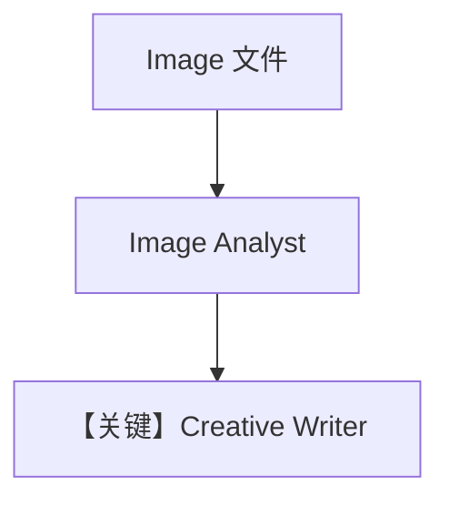

# image_to_text.py — 实现原理分析

<!-- cookbook-py-source:start -->
## 完整源码

```python
"""
Image To Text
=============================

Demonstrates collaborative image analysis and narrative generation.
"""

from pathlib import Path

from agno.agent import Agent
from agno.media import Image
from agno.models.openai import OpenAIResponses
from agno.team import Team

# ---------------------------------------------------------------------------
# Create Members
# ---------------------------------------------------------------------------
image_analyzer = Agent(
    name="Image Analyst",
    role="Analyze and describe images in detail",
    model=OpenAIResponses(id="gpt-5.2"),
    instructions=[
        "Analyze images carefully and provide detailed descriptions",
        "Focus on visual elements, composition, and key details",
    ],
)

creative_writer = Agent(
    name="Creative Writer",
    role="Create engaging stories and narratives",
    model=OpenAIResponses(id="gpt-5.2"),
    instructions=[
        "Transform image descriptions into compelling fiction stories",
        "Use vivid language and creative storytelling techniques",
    ],
)

# ---------------------------------------------------------------------------
# Create Team
# ---------------------------------------------------------------------------
image_team = Team(
    name="Image Story Team",
    model=OpenAIResponses(id="gpt-5.2"),
    members=[image_analyzer, creative_writer],
    instructions=[
        "Work together to create compelling fiction stories from images.",
        "Image Analyst: First analyze the image for visual details and context.",
        "Creative Writer: Transform the analysis into engaging fiction narratives.",
        "Ensure the story captures the essence and mood of the image.",
    ],
    markdown=True,
)

# ---------------------------------------------------------------------------
# Run Team
# ---------------------------------------------------------------------------
if __name__ == "__main__":
    image_path = Path(__file__).parent.joinpath("sample.jpg")
    image_team.print_response(
        "Write a 3 sentence fiction story about the image",
        images=[Image(filepath=image_path)],
    )
```

<!-- cookbook-py-source:end -->

> 源文件：`cookbook/03_teams/19_multimodal/image_to_text.py`

## 概述

本示例展示 **图像分析 + 叙事写作** 两成员：`Image` 由路径加载，Image Analyst 产出描述，Creative Writer 再生成故事。

**核心配置一览：** `image_team`，`OpenAIResponses(gpt-5.2)`，成员 `instructions` 见 `.py` L22-35、41-46。

## System Prompt 组装

队长额外 `instructions` 协调二者；媒体在 `<attached_media>` 进入 system（若本 run 带图）。

### 还原（成员 instructions 节选）

见源码 `image_analyzer` / `creative_writer` 的 `instructions` 列表，须原样引用。

## Mermaid 流程图


```mermaid
flowchart TD
    Img["Image 文件"] --> An["Image Analyst"]
    An --> Wr["【关键】Creative Writer"]
```

## 关键源码文件索引

| 文件 | 作用 |
|------|------|
| `agno/media/` | `Image` |
