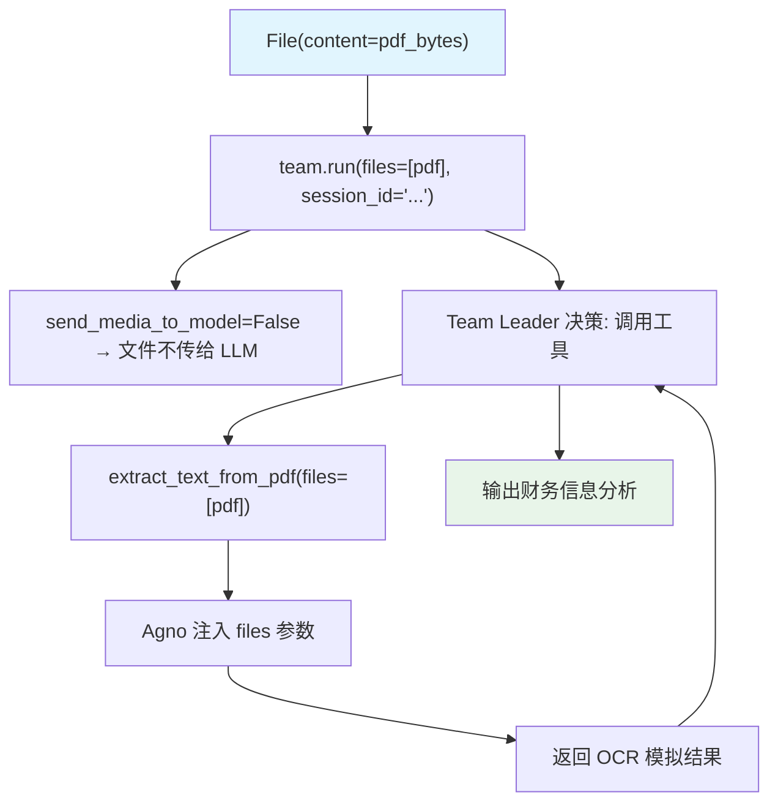

# media_input_for_tool.py — 实现原理分析

> 源文件：`cookbook/03_teams/19_multimodal/media_input_for_tool.py`

## 概述

本示例展示 **文件媒体直接传入 Team 工具**：用户上传 PDF（`File` 对象），Team Leader 不将文件内容发送给 LLM 视觉层（`send_media_to_model=False`），而是通过 `extract_text_from_pdf` 工具函数直接访问 `files` 参数（Agno 自动注入上传的文件）。`store_media=True` 确保文件被持久化以备后续工具调用。

**核心配置一览：**

| 配置项 | 值 | 说明 |
|--------|------|------|
| `send_media_to_model` | `False` | 不将文件发给 LLM 视觉层 |
| `store_media` | `True` | 持久化上传文件 |
| 工具参数 | `files: Optional[Sequence[File]]` | Agno 自动注入 |

## 核心组件解析

### 工具函数接收文件

```python
class DocumentProcessingTools(Toolkit):
    def extract_text_from_pdf(
        self, 
        files: Optional[Sequence[File]] = None  # Agno 自动注入上传的文件
    ) -> str:
        for file in files:
            if file.content:
                text = process(file.content)  # 访问字节内容
```

Agno 检测到工具函数有 `files` 参数时，自动将 `run(files=[...])` 传入的文件注入。

### `send_media_to_model=False` 的意义

| 值 | 行为 |
|----|------|
| `True`（默认） | 文件内容编码后附加到 LLM 消息中（用于视觉分析） |
| `False` | 文件不发给 LLM，只通过工具函数访问 |

对于 PDF 等非图像文件，不需要 LLM 直接"看"，通过工具 OCR 提取文本更合理。

### Team Leader 直接处理（不委托成员）

```python
instructions=[
    "Do not delegate tasks to team members - handle everything yourself using the available tools.",
]
```

Leader 挂载了 `DocumentProcessingTools`，直接调用工具而非委托 `member_agent`。

## Mermaid 流程图



## 关键源码文件索引

| 文件 | 关键函数/类 | 作用 |
|------|------------|------|
| `agno/media/__init__.py` | `File` | 文件媒体对象 |
| `agno/team/team.py` | `send_media_to_model`, `store_media` | 媒体处理配置 |
