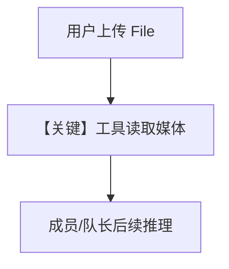

# media_input_for_tool.py — 实现原理分析

> 源文件：`cookbook/03_teams/19_multimodal/media_input_for_tool.py`

## 概述

本示例展示 **Team 工具直接消费用户上传的 `File`/媒体**：工具签名接受 `Sequence[File]` 或类似类型，由 `run_context` 或参数注入，用于在成员间传递非文本负载。

## 运行机制与因果链

与纯文本工具不同，媒体需通过 **工具入参映射** 或 **RunContext 媒体列表** 对齐 OpenAI/Google 的附件语义。

## Mermaid 流程图

```mermaid
flowchart TD
    U["用户上传 File"] --> Tool["【关键】工具读取媒体"]
    Tool --> M["成员/队长后续推理"]
```

## 关键源码文件索引

| 文件 | 作用 |
|------|------|
| `agno/media/` | `File` |
