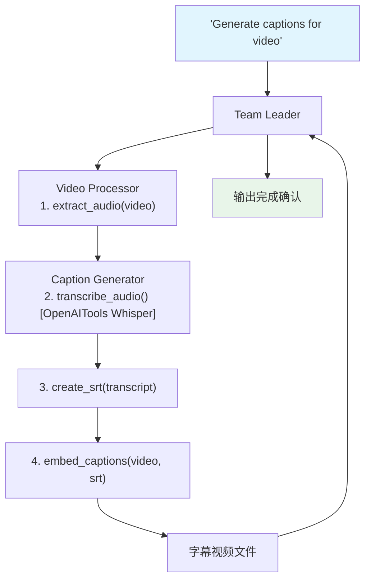

# video_caption_generation.py — 实现原理分析

> 源文件：`cookbook/03_teams/19_multimodal/video_caption_generation.py`

## 概述

本示例展示 **视频字幕生成 Team**：Video Processor 使用 `MoviePyVideoTools` 提取音频和生成字幕，Caption Generator 使用 `OpenAITools`（Whisper 转录）和 `MoviePyVideoTools`（字幕嵌入）将 SRT 字幕嵌入视频。四步流水线：提取音频 → 转录 → 生成 SRT → 嵌入字幕。

**核心配置一览：**

| 成员 | 工具 | 职责 |
|------|------|------|
| Video Processor | `MoviePyVideoTools(enable_process_video, enable_generate_captions)` | 音频提取 |
| Caption Generator | `MoviePyVideoTools(enable_embed_captions)` + `OpenAITools` | 转录 + 嵌入 |

## 核心组件解析

### 四步字幕流水线

```
1. extract_audio(video)         → 提取 MP3/WAV 音频
2. transcribe_audio(audio)      → Whisper 转录为文本
3. create_srt(text, timing)     → 生成带时间戳的 SRT 格式
4. embed_captions(video, srt)   → 将字幕烧录到视频
```

### `MoviePyVideoTools` 功能分拆

```python
# Video Processor: 只启用视频处理和字幕生成
MoviePyVideoTools(
    enable_process_video=True,
    enable_generate_captions=True
)

# Caption Generator: 只启用字幕嵌入
MoviePyVideoTools(enable_embed_captions=True)
```

按需启用功能，避免暴露不必要的工具给每个成员。

### `OpenAITools` 的角色

`OpenAITools` 提供 Whisper 转录 API 调用，Caption Generator 用它将音频文件转为文字，再生成 SRT 格式。

## Mermaid 流程图



## 关键源码文件索引

| 文件 | 关键函数/类 | 作用 |
|------|------------|------|
| `agno/tools/moviepy_video.py` | `MoviePyVideoTools` | 视频处理工具 |
| `agno/tools/openai.py` | `OpenAITools` | Whisper 转录 API |
