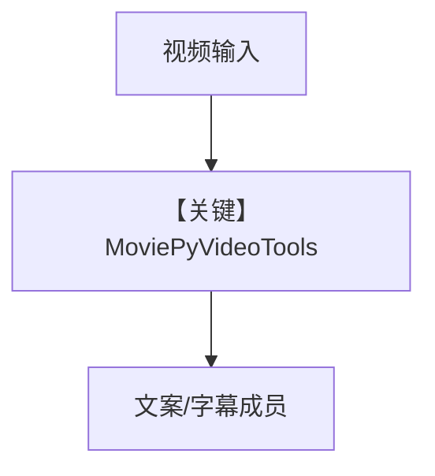

# video_caption_generation.py — 实现原理分析

<!-- cookbook-py-source:start -->
## 完整源码

```python
"""
Video Caption Generation
========================

Demonstrates team-based video caption generation and embedding workflow.
"""

from agno.agent import Agent
from agno.models.openai import OpenAIResponses
from agno.team import Team
from agno.tools.moviepy_video import MoviePyVideoTools
from agno.tools.openai import OpenAITools

# ---------------------------------------------------------------------------
# Create Members
# ---------------------------------------------------------------------------
video_processor = Agent(
    name="Video Processor",
    role="Handle video processing and audio extraction",
    model=OpenAIResponses(id="gpt-5.2"),
    tools=[MoviePyVideoTools(enable_process_video=True, enable_generate_captions=True)],
    instructions=[
        "Extract audio from videos for processing",
        "Handle video file operations efficiently",
    ],
)

caption_generator = Agent(
    name="Caption Generator",
    role="Generate and embed captions in videos",
    model=OpenAIResponses(id="gpt-5.2"),
    tools=[MoviePyVideoTools(enable_embed_captions=True), OpenAITools()],
    instructions=[
        "Transcribe audio to create accurate captions",
        "Generate SRT format captions with proper timing",
        "Embed captions seamlessly into videos",
    ],
)

# ---------------------------------------------------------------------------
# Create Team
# ---------------------------------------------------------------------------
caption_team = Team(
    name="Video Caption Team",
    members=[video_processor, caption_generator],
    model=OpenAIResponses(id="gpt-5.2"),
    description="Team that generates and embeds captions for videos",
    instructions=[
        "Process videos to generate captions in this sequence:",
        "1. Extract audio from the video using extract_audio",
        "2. Transcribe the audio using transcribe_audio",
        "3. Generate SRT captions using create_srt",
        "4. Embed captions into the video using embed_captions",
    ],
    markdown=True,
)

# ---------------------------------------------------------------------------
# Run Team
# ---------------------------------------------------------------------------
if __name__ == "__main__":
    caption_team.print_response(
        "Generate captions for {video with location} and embed them in the video"
    )
```

<!-- cookbook-py-source:end -->

> 源文件：`cookbook/03_teams/19_multimodal/video_caption_generation.py`

## 概述

本示例展示 **`MoviePyVideoTools` + Team**：视频处理/关键帧或片段级理解并生成字幕或描述，成员可分工「切片/解说/润色」。

## 运行机制与因果链

视频路径或 URL 经工具读入；可能产生大量中间文本进入上下文，需注意 token。

## Mermaid 流程图


```mermaid
flowchart TD
    V["视频输入"] --> MP["【关键】MoviePyVideoTools"]
    MP --> C["文案/字幕成员"]
```

## 关键源码文件索引

| 文件 | 作用 |
|------|------|
| `agno/tools/moviepy_video.py` | `MoviePyVideoTools` |
