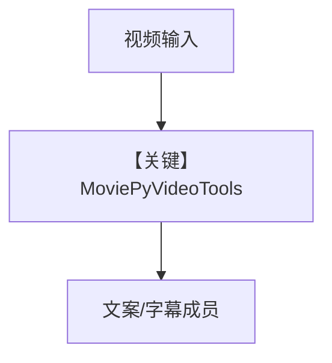

# video_caption_generation.py — 实现原理分析

> 源文件：`cookbook/03_teams/19_multimodal/video_caption_generation.py`

## 概述

本示例展示 **`MoviePyVideoTools` + Team**：视频处理/关键帧或片段级理解并生成字幕或描述，成员可分工「切片/解说/润色」。

## 运行机制与因果链

视频路径或 URL 经工具读入；可能产生大量中间文本进入上下文，需注意 token。

## Mermaid 流程图

```mermaid
flowchart TD
    V["视频输入"] --> MP["【关键】MoviePyVideoTools"]
    MP --> C["文案/字幕成员"]
```

## 关键源码文件索引

| 文件 | 作用 |
|------|------|
| `agno/tools/moviepy_video.py` | `MoviePyVideoTools` |
