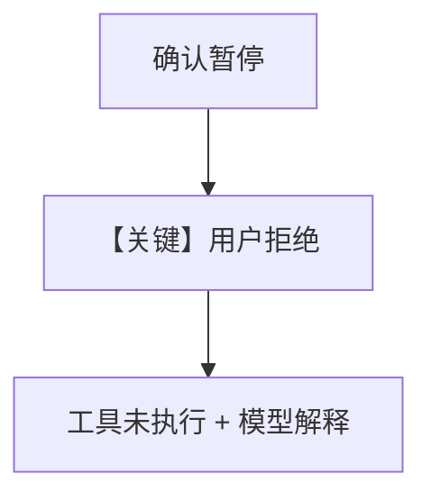

# confirmation_rejected.py — 实现原理分析

> 源文件：`cookbook/03_teams/20_human_in_the_loop/confirmation_rejected.py`

## 概述

本示例展示用户在 **确认点拒绝** 工具执行时的行为：成员/队长收到拒绝结果并继续对话或报错路径（以 `.py` 内 prompt 与分支为准）。

## 运行机制与因果链

`continue_run` 传入拒绝语义 → 工具不执行 → 模型根据结果生成说明。

## Mermaid 流程图

## 关键源码文件索引

| 文件 | 作用 |
|------|------|
| `agno/team/_run.py` | HITL 解析 |
