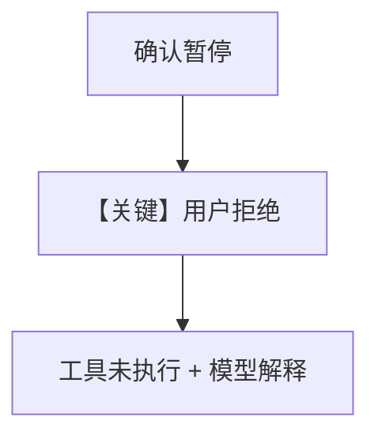

# confirmation_rejected.py — 实现原理分析

<!-- cookbook-py-source:start -->
## 完整源码

```python
"""Team HITL: Rejecting a member agent tool call.

This example demonstrates how the team handles rejection of a tool
call. After rejection, the team continues and the model responds
acknowledging the rejection.
"""

from agno.agent import Agent
from agno.models.openai import OpenAIResponses
from agno.team.team import Team
from agno.tools import tool


# ---------------------------------------------------------------------------
# Tools
# ---------------------------------------------------------------------------
@tool(requires_confirmation=True)
def delete_user_account(username: str) -> str:
    """Permanently delete a user account and all associated data.

    Args:
        username (str): Username of the account to delete
    """
    return f"Account {username} has been permanently deleted"


# ---------------------------------------------------------------------------
# Create Members
# ---------------------------------------------------------------------------
admin_agent = Agent(
    name="Admin Agent",
    role="Handles account administration tasks",
    model=OpenAIResponses(id="gpt-5-mini"),
    tools=[delete_user_account],
)

# ---------------------------------------------------------------------------
# Create Team
# ---------------------------------------------------------------------------
team = Team(
    name="Admin Team",
    members=[admin_agent],
    model=OpenAIResponses(id="gpt-5-mini"),
)

# ---------------------------------------------------------------------------
# Run Team
# ---------------------------------------------------------------------------
if __name__ == "__main__":
    response = team.run("Delete the account for user 'jsmith'")

    if response.is_paused:
        print("Team paused - requires confirmation")
        for req in response.requirements:
            if req.needs_confirmation:
                print(f"  Tool: {req.tool_execution.tool_name}")
                print(f"  Args: {req.tool_execution.tool_args}")

                # Reject the dangerous operation
                req.reject(note="Account deletion requires manager approval first")

        response = team.continue_run(response)
        print(f"Result: {response.content}")
    else:
        print(f"Result: {response.content}")
```

<!-- cookbook-py-source:end -->

> 源文件：`cookbook/03_teams/20_human_in_the_loop/confirmation_rejected.py`

## 概述

本示例展示用户在 **确认点拒绝** 工具执行时的行为：成员/队长收到拒绝结果并继续对话或报错路径（以 `.py` 内 prompt 与分支为准）。

## 运行机制与因果链

`continue_run` 传入拒绝语义 → 工具不执行 → 模型根据结果生成说明。

## Mermaid 流程图



## 关键源码文件索引

| 文件 | 作用 |
|------|------|
| `agno/team/_run.py` | HITL 解析 |
