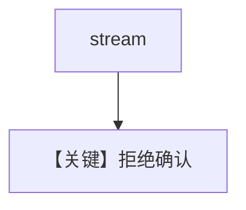

# confirmation_rejected_stream.py — 实现原理分析

> 源文件：`cookbook/03_teams/20_human_in_the_loop/confirmation_rejected_stream.py`

## 概述

**流式** 场景下用户 **拒绝** 需确认的工具调用：事件序列与 `confirmation_rejected.py` 对称，区别在 `stream=True` 的消费方式。

## Mermaid 流程图

## 关键源码文件索引

| 文件 | 作用 |
|------|------|
| `agno/team/_run.py` | 流式 HITL |
