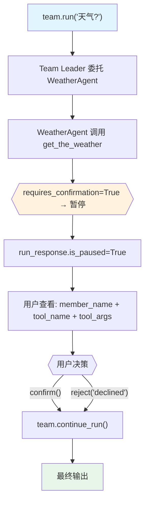

# confirmation_required.py — 实现原理分析

> 源文件：`cookbook/03_teams/20_human_in_the_loop/confirmation_required.py`

## 概述

本示例展示 **Team 级 Human-in-the-Loop 工具确认**：`@tool(requires_confirmation=True)` 标记工具，成员 Agent 调用时暂停（`is_paused=True`），暂停状态冒泡到 Team 层。用户通过 `requirement.confirm()` 或 `requirement.reject()` 决策，然后 `team.continue_run(run_response)` 恢复执行。

**核心配置一览：**

| 配置项 | 值 | 说明 |
|--------|------|------|
| `@tool(requires_confirmation=True)` | 工具装饰器 | 调用前需人工确认 |
| `run_response.is_paused` | `bool` | 检测是否暂停 |
| `requirement.needs_confirmation` | `bool` | 确认类型判断 |
| `requirement.confirm()` | 方法 | 批准工具调用 |
| `requirement.reject(note=...)` | 方法 | 拒绝工具调用 |
| `team.continue_run(run_response)` | 方法 | 恢复执行 |

## 核心组件解析

### HITL 流程三步

```python
# 1. 首次运行，可能暂停
run_response = team.run("What is the weather in Tokyo?", session_id=session_id)

# 2. 检查暂停状态，处理 requirements
if run_response.is_paused:
    for requirement in run_response.active_requirements:
        if requirement.needs_confirmation:
            # 显示工具信息
            print(requirement.member_agent_name)  # 哪个成员
            print(requirement.tool_execution.tool_name)  # 哪个工具
            print(requirement.tool_execution.tool_args)  # 工具参数
            
            # 用户决策
            if user_says_no:
                requirement.reject(note="User declined")
            else:
                requirement.confirm()

# 3. 继续执行
run_response = team.continue_run(run_response)
```

### `requirement.member_agent_name` 的重要性

Team 中多个成员可能各有不同的确认需求，`member_agent_name` 标识是哪个成员 Agent 请求确认，便于精细化权限控制。

### 会话持久化保证恢复

```python
db = SqliteDb(session_table="team_hitl_sessions", db_file="tmp/team_hitl.db")
```

Agent 和 Team 共享同一个 `db`，确保暂停状态和会话历史持久化，`continue_run` 能从正确的中断点恢复。

## Mermaid 流程图



## 关键源码文件索引

| 文件 | 关键函数/类 | 作用 |
|------|------------|------|
| `agno/tools/__init__.py` | `@tool(requires_confirmation=True)` | 工具确认标记 |
| `agno/run/requirement.py` | `RunRequirement`, `confirm()`, `reject()` | 需求处理 |
| `agno/team/_run.py` | `continue_run()` | 恢复执行 |
