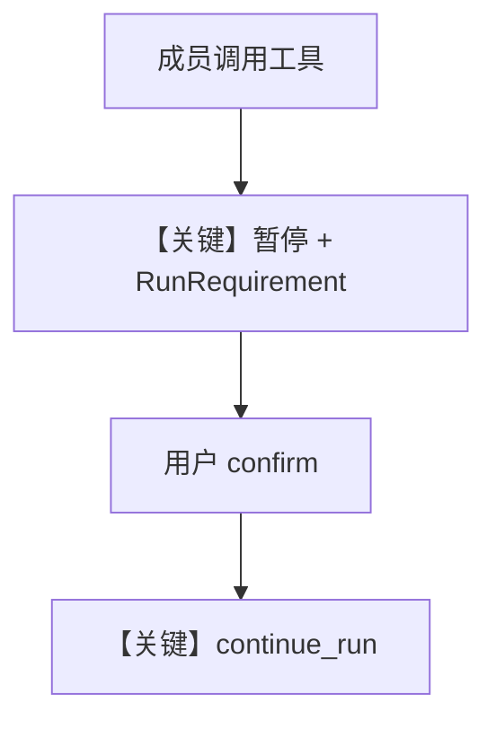

# confirmation_required.py — 实现原理分析

> 源文件：`cookbook/03_teams/20_human_in_the_loop/confirmation_required.py`

## 概述

本示例展示 **`@tool(requires_confirmation=True)`** 在 **成员 Agent** 上触发时，暂停上浮到 **Team**，终端用 y/n 确认后 **`team.continue_run()`** 恢复执行；`SqliteDb` 持久化会话。

**核心配置一览：**

| 配置项 | 值 |
|--------|-----|
| `get_the_weather` | `requires_confirmation=True` |
| `db` | `SqliteDb(tmp/team_hitl.db, session_table=team_hitl_sessions)` |
| `add_history_to_context` | `True` |

## 运行机制与因果链

1. 成员调用工具 → 生成 `RunRequirement`（确认）→ Team 级暂停。
2. 用户确认 → `continue_run` 将决策路由回成员工具层（见 `agno/team/_run.py`、`cookbook/.../CLAUDE.md` 索引）。

## System Prompt 组装

与普通 Team 相同；工具 schema 含 confirmation 元数据，由框架注入。

## Mermaid 流程图

```mermaid
flowchart TD
    T["成员调用工具"] --> P["【关键】暂停 + RunRequirement"]
    P --> C["用户 confirm"]
    C --> R["【关键】continue_run"]
```

## 关键源码文件索引

| 文件 | 作用 |
|------|------|
| `agno/run/requirement.py` | `RunRequirement` |
| `agno/team/_run.py` | `continue_run` |
