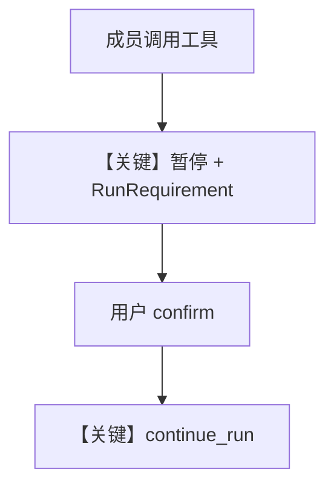

# confirmation_required.py — 实现原理分析

<!-- cookbook-py-source:start -->
## 完整源码

```python
"""
Confirmation Required
=============================

Demonstrates team-level pause/continue flow for confirmation-required member tools.
"""

from agno.agent import Agent
from agno.db.sqlite import SqliteDb
from agno.models.openai import OpenAIResponses
from agno.team import Team
from agno.tools import tool
from agno.utils import pprint
from rich.console import Console
from rich.prompt import Prompt

# ---------------------------------------------------------------------------
# Setup
# ---------------------------------------------------------------------------
console = Console()

db = SqliteDb(session_table="team_hitl_sessions", db_file="tmp/team_hitl.db")


@tool(requires_confirmation=True)
def get_the_weather(city: str) -> str:
    """Get the current weather for a city."""
    return f"It is currently 70 degrees and cloudy in {city}"


# ---------------------------------------------------------------------------
# Create Members
# ---------------------------------------------------------------------------
weather_agent = Agent(
    name="WeatherAgent",
    model=OpenAIResponses(id="gpt-5.2"),
    tools=[get_the_weather],
    db=db,
    telemetry=False,
)

# ---------------------------------------------------------------------------
# Create Team
# ---------------------------------------------------------------------------
team = Team(
    name="WeatherTeam",
    model=OpenAIResponses(id="gpt-5.2"),
    members=[weather_agent],
    db=db,
    telemetry=False,
    add_history_to_context=True,
)

# ---------------------------------------------------------------------------
# Run Team
# ---------------------------------------------------------------------------
if __name__ == "__main__":
    session_id = "team_weather_session"
    run_response = team.run("What is the weather in Tokyo?", session_id=session_id)

    if run_response.is_paused:
        console.print("[bold yellow]Team is paused - member needs confirmation[/]")

        for requirement in run_response.active_requirements:
            if requirement.needs_confirmation:
                console.print(
                    f"Member [bold cyan]{requirement.member_agent_name}[/] wants to call "
                    f"[bold blue]{requirement.tool_execution.tool_name}"
                    f"({requirement.tool_execution.tool_args})[/]"
                )

                message = (
                    Prompt.ask(
                        "Do you want to approve?", choices=["y", "n"], default="y"
                    )
                    .strip()
                    .lower()
                )

                if message == "n":
                    requirement.reject(note="User declined")
                else:
                    requirement.confirm()

        run_response = team.continue_run(run_response)

    pprint.pprint_run_response(run_response)
```

<!-- cookbook-py-source:end -->

> 源文件：`cookbook/03_teams/20_human_in_the_loop/confirmation_required.py`

## 概述

本示例展示 **`@tool(requires_confirmation=True)`** 在 **成员 Agent** 上触发时，暂停上浮到 **Team**，终端用 y/n 确认后 **`team.continue_run()`** 恢复执行；`SqliteDb` 持久化会话。

**核心配置一览：**

| 配置项 | 值 |
|--------|-----|
| `get_the_weather` | `requires_confirmation=True` |
| `db` | `SqliteDb(tmp/team_hitl.db, session_table=team_hitl_sessions)` |
| `add_history_to_context` | `True` |

## 运行机制与因果链

1. 成员调用工具 → 生成 `RunRequirement`（确认）→ Team 级暂停。
2. 用户确认 → `continue_run` 将决策路由回成员工具层（见 `agno/team/_run.py`、`cookbook/.../CLAUDE.md` 索引）。

## System Prompt 组装

与普通 Team 相同；工具 schema 含 confirmation 元数据，由框架注入。

## Mermaid 流程图


```mermaid
flowchart TD
    T["成员调用工具"] --> P["【关键】暂停 + RunRequirement"]
    P --> C["用户 confirm"]
    C --> R["【关键】continue_run"]
```

## 关键源码文件索引

| 文件 | 作用 |
|------|------|
| `agno/run/requirement.py` | `RunRequirement` |
| `agno/team/_run.py` | `continue_run` |
