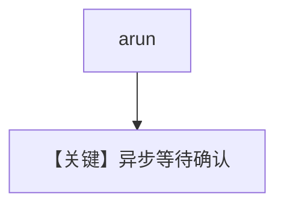

# confirmation_required_async.py — 实现原理分析

<!-- cookbook-py-source:start -->
## 完整源码

```python
"""Team HITL: Async member agent tool confirmation.

Same as confirmation_required.py but uses async run/continue_run.
"""

import asyncio

from agno.agent import Agent
from agno.models.openai import OpenAIResponses
from agno.team.team import Team
from agno.tools import tool


# ---------------------------------------------------------------------------
# Tools
# ---------------------------------------------------------------------------
@tool(requires_confirmation=True)
def deploy_to_production(app_name: str, version: str) -> str:
    """Deploy an application to production.

    Args:
        app_name (str): Name of the application
        version (str): Version to deploy
    """
    return f"Successfully deployed {app_name} v{version} to production"


# ---------------------------------------------------------------------------
# Create Members
# ---------------------------------------------------------------------------
deploy_agent = Agent(
    name="Deploy Agent",
    role="Handles deployments to production",
    model=OpenAIResponses(id="gpt-5-mini"),
    tools=[deploy_to_production],
)


# ---------------------------------------------------------------------------
# Create Team
# ---------------------------------------------------------------------------
team = Team(
    name="DevOps Team",
    members=[deploy_agent],
    model=OpenAIResponses(id="gpt-5-mini"),
)


# ---------------------------------------------------------------------------
# Run Team
# ---------------------------------------------------------------------------
if __name__ == "__main__":

    async def main():
        response = await team.arun("Deploy the payments app version 2.1 to production")

        if response.is_paused:
            print("Team paused - requires confirmation")
            for req in response.requirements:
                if req.needs_confirmation:
                    print(f"  Tool: {req.tool_execution.tool_name}")
                    print(f"  Args: {req.tool_execution.tool_args}")
                    req.confirm()

            response = await team.acontinue_run(response)
            print(f"Result: {response.content}")
        else:
            print(f"Result: {response.content}")

    asyncio.run(main())
```

<!-- cookbook-py-source:end -->

> 源文件：`cookbook/03_teams/20_human_in_the_loop/confirmation_required_async.py`

## 概述

**异步** `aprint_response` / `arun` 路径上的工具确认：暂停与 `acontinue_run`（或等价 API）配合，避免阻塞事件循环。

## Mermaid 流程图



## 关键源码文件索引

| 文件 | 作用 |
|------|------|
| `agno/team/team.py` | `arun` / async continue |
