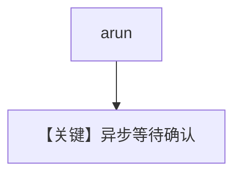

# confirmation_required_async.py — 实现原理分析

> 源文件：`cookbook/03_teams/20_human_in_the_loop/confirmation_required_async.py`

## 概述

**异步** `aprint_response` / `arun` 路径上的工具确认：暂停与 `acontinue_run`（或等价 API）配合，避免阻塞事件循环。

## Mermaid 流程图

## 关键源码文件索引

| 文件 | 作用 |
|------|------|
| `agno/team/team.py` | `arun` / async continue |
