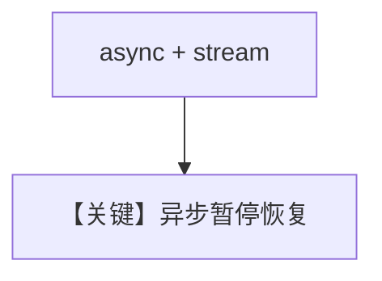

# confirmation_required_async_stream.py — 实现原理分析

> 源文件：`cookbook/03_teams/20_human_in_the_loop/confirmation_required_async_stream.py`

## 概述

**异步 + 流式** 同时启用时的 HITL 确认：结合 `asyncio` 与 async iterator 消费 chunk，确认点仍经 `RunRequirement`。

## Mermaid 流程图

## 关键源码文件索引

| 文件 | 作用 |
|------|------|
| `agno/team/_run.py` | `arun(..., stream=True)` |
