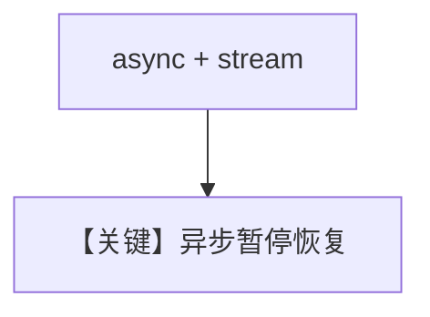

# confirmation_required_async_stream.py — 实现原理分析

<!-- cookbook-py-source:start -->
## 完整源码

```python
"""Team HITL Async Streaming: Member agent tool requiring confirmation.

Same as confirmation_required_stream.py but uses async run/continue_run.

Note: When streaming with member agents, use isinstance() with TeamRunPausedEvent
to distinguish the team's pause from member agent pauses.
"""

import asyncio

from agno.agent import Agent
from agno.db.sqlite import SqliteDb
from agno.models.openai import OpenAIResponses
from agno.run.team import RunPausedEvent as TeamRunPausedEvent
from agno.team.team import Team
from agno.tools import tool
from agno.utils import pprint

# ---------------------------------------------------------------------------
# Setup
# ---------------------------------------------------------------------------
db = SqliteDb(db_file="tmp/team_hitl_stream.db")


# ---------------------------------------------------------------------------
# Tools
# ---------------------------------------------------------------------------
@tool(requires_confirmation=True)
def deploy_to_production(app_name: str, version: str) -> str:
    """Deploy an application to production.

    Args:
        app_name (str): Name of the application
        version (str): Version to deploy
    """
    return f"Successfully deployed {app_name} v{version} to production"


# ---------------------------------------------------------------------------
# Create Members
# ---------------------------------------------------------------------------
deploy_agent = Agent(
    name="Deploy Agent",
    role="Handles deployments to production",
    model=OpenAIResponses(id="gpt-5-mini"),
    tools=[deploy_to_production],
    db=db,
)


# ---------------------------------------------------------------------------
# Create Team
# ---------------------------------------------------------------------------
team = Team(
    name="DevOps Team",
    members=[deploy_agent],
    model=OpenAIResponses(id="gpt-5-mini"),
    db=db,
)


async def main():
    async for run_event in team.arun(
        "Deploy the payments app version 2.1 to production", stream=True
    ):
        # Use isinstance to check for team's pause event (not the member agent's)
        if isinstance(run_event, TeamRunPausedEvent):
            print("Team paused - requires confirmation")
            for req in run_event.active_requirements:
                if req.needs_confirmation:
                    print(f"  Tool: {req.tool_execution.tool_name}")
                    print(f"  Args: {req.tool_execution.tool_args}")
                    req.confirm()

            # Use apprint_run_response for async streaming
            response = team.acontinue_run(
                run_id=run_event.run_id,
                session_id=run_event.session_id,
                requirements=run_event.requirements,
                stream=True,
            )
            await pprint.apprint_run_response(response)


# ---------------------------------------------------------------------------
# Run Team
# ---------------------------------------------------------------------------
if __name__ == "__main__":
    asyncio.run(main())
```

<!-- cookbook-py-source:end -->

> 源文件：`cookbook/03_teams/20_human_in_the_loop/confirmation_required_async_stream.py`

## 概述

**异步 + 流式** 同时启用时的 HITL 确认：结合 `asyncio` 与 async iterator 消费 chunk，确认点仍经 `RunRequirement`。

## Mermaid 流程图



## 关键源码文件索引

| 文件 | 作用 |
|------|------|
| `agno/team/_run.py` | `arun(..., stream=True)` |
