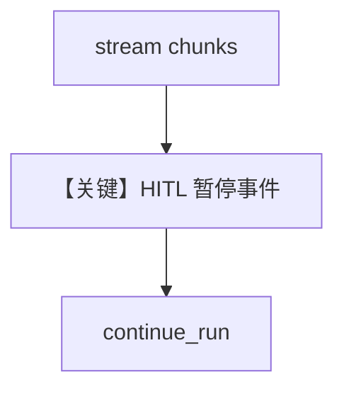

# confirmation_required_stream.py — 实现原理分析

> 源文件：`cookbook/03_teams/20_human_in_the_loop/confirmation_required_stream.py`

## 概述

与 `confirmation_required.py` 相同机制，区别为 **`stream=True`**：事件流中仍会在确认点暂停，恢复后继续流式输出。

## 运行机制与因果链

流式 chunk 需识别 **暂停/继续** 事件；确认逻辑与非流式共享。

## Mermaid 流程图

## 关键源码文件索引

| 文件 | 作用 |
|------|------|
| `agno/team/_run.py` | 流式 + HITL |
