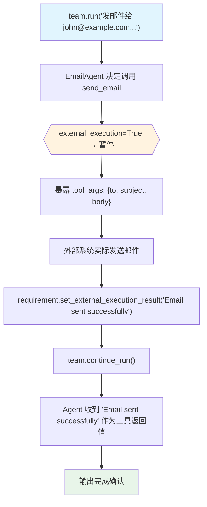

# external_tool_execution.py — 实现原理分析

> 源文件：`cookbook/03_teams/20_human_in_the_loop/external_tool_execution.py`

## 概述

本示例展示 **Team 级外部工具执行**：`@tool(external_execution=True)` 标记工具，意味着工具的实际执行由外部系统负责（如第三方 API、人工操作）。Agent 暂停并提供工具参数，外部系统执行后通过 `requirement.set_external_execution_result(result)` 注入结果，`team.continue_run()` 将结果返回给 Agent 继续。

**核心配置一览：**

| 配置项 | 值 | 说明 |
|--------|------|------|
| `@tool(external_execution=True)` | 工具装饰器 | 工具体不执行，等待外部结果 |
| `requirement.needs_external_execution` | `bool` | 外部执行类型判断 |
| `requirement.tool_execution.tool_args` | `dict` | 工具调用参数（供外部使用） |
| `requirement.set_external_execution_result(str)` | 方法 | 注入外部执行结果 |

## 核心组件解析

### 外部执行工具声明

```python
@tool(external_execution=True)
def send_email(to: str, subject: str, body: str) -> str:
    """Send an email to someone. Executed externally."""
    return ""  # 函数体不会被调用
```

`external_execution=True` 时，`send_email` 的函数体被忽略，LLM 生成的参数通过 `tool_execution.tool_args` 暴露给外部。

### 外部执行结果注入

```python
for requirement in run_response.active_requirements:
    if requirement.needs_external_execution:
        tool_args = requirement.tool_execution.tool_args
        # 外部系统执行（此例用用户输入模拟）
        result = Prompt.ask("Enter the result of the email send", 
                           default="Email sent successfully")
        requirement.set_external_execution_result(result)
```

### 三种 HITL 模式对比

| 模式 | 装饰器参数 | Agent 看到的结果 |
|------|-----------|----------------|
| 确认 | `requires_confirmation=True` | 工具正常执行 or 被拒绝 |
| 用户输入 | `requires_user_input=True` | 工具用用户值执行 |
| 外部执行 | `external_execution=True` | 外部注入的 result 字符串 |

## Mermaid 流程图



## 关键源码文件索引

| 文件 | 关键函数/类 | 作用 |
|------|------------|------|
| `agno/tools/__init__.py` | `@tool(external_execution=True)` | 外部执行标记 |
| `agno/run/requirement.py` | `set_external_execution_result()` | 注入外部结果 |
