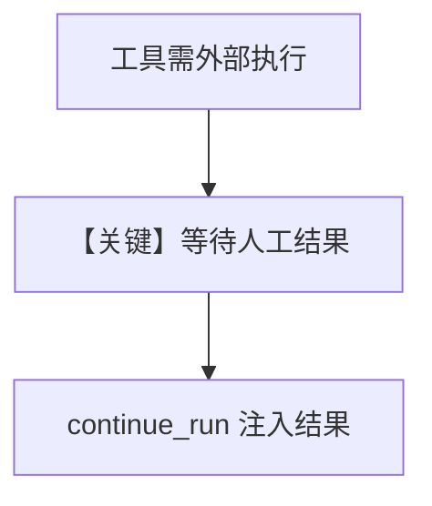

# external_tool_execution.py — 实现原理分析

> 源文件：`cookbook/03_teams/20_human_in_the_loop/external_tool_execution.py`

## 概述

本示例展示 **工具在进程外执行**（如人工发邮件）：运行暂停等待用户把 **外部执行结果** 填回，再通过 `continue_run` 继续，使模型拿到 tool result。

## 运行机制与因果链

区别于确认布尔值：此处 tool 结果 **延迟由人提供**，依赖 session/run 状态机。

## Mermaid 流程图

```mermaid
flowchart TD
    E["工具需外部执行"] --> W["【关键】等待人工结果"]
    W --> C["continue_run 注入结果"]
```

## 关键源码文件索引

| 文件 | 作用 |
|------|------|
| `agno/run/requirement.py` | 外部结果类型 |
