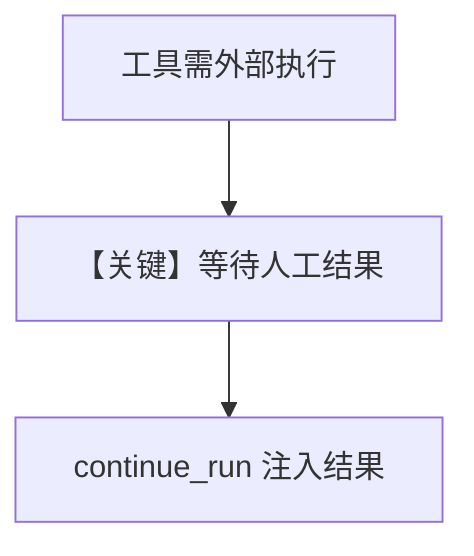

# external_tool_execution.py — 实现原理分析

<!-- cookbook-py-source:start -->
## 完整源码

```python
"""
External Tool Execution
=============================

Demonstrates resolving external tool execution requirements in team flows.
"""

from agno.agent import Agent
from agno.db.sqlite import SqliteDb
from agno.models.openai import OpenAIResponses
from agno.team import Team
from agno.tools import tool
from agno.utils import pprint
from rich.console import Console
from rich.prompt import Prompt

# ---------------------------------------------------------------------------
# Setup
# ---------------------------------------------------------------------------
console = Console()

db = SqliteDb(session_table="team_ext_exec_sessions", db_file="tmp/team_hitl.db")


@tool(external_execution=True)
def send_email(to: str, subject: str, body: str) -> str:
    """Send an email to someone. Executed externally."""
    return ""


# ---------------------------------------------------------------------------
# Create Members
# ---------------------------------------------------------------------------
email_agent = Agent(
    name="EmailAgent",
    model=OpenAIResponses(id="gpt-5.2"),
    tools=[send_email],
    db=db,
    telemetry=False,
)

# ---------------------------------------------------------------------------
# Create Team
# ---------------------------------------------------------------------------
team = Team(
    name="CommunicationTeam",
    model=OpenAIResponses(id="gpt-5.2"),
    members=[email_agent],
    db=db,
    telemetry=False,
    add_history_to_context=True,
)

# ---------------------------------------------------------------------------
# Run Team
# ---------------------------------------------------------------------------
if __name__ == "__main__":
    session_id = "team_email_session"
    run_response = team.run(
        "Send an email to john@example.com with subject 'Meeting Tomorrow' and body 'Let's meet at 3pm.'",
        session_id=session_id,
    )

    if run_response.is_paused:
        console.print("[bold yellow]Team is paused - external execution needed[/]")

        for requirement in run_response.active_requirements:
            if requirement.needs_external_execution:
                tool_args = requirement.tool_execution.tool_args
                console.print(
                    f"Member [bold cyan]{requirement.member_agent_name}[/] needs external execution of "
                    f"[bold blue]{requirement.tool_execution.tool_name}[/]"
                )
                console.print(f"  To: {tool_args.get('to')}")
                console.print(f"  Subject: {tool_args.get('subject')}")
                console.print(f"  Body: {tool_args.get('body')}")

                result = Prompt.ask(
                    "Enter the result of the email send",
                    default="Email sent successfully",
                )
                requirement.set_external_execution_result(result)

        run_response = team.continue_run(run_response)

    pprint.pprint_run_response(run_response)
```

<!-- cookbook-py-source:end -->

> 源文件：`cookbook/03_teams/20_human_in_the_loop/external_tool_execution.py`

## 概述

本示例展示 **工具在进程外执行**（如人工发邮件）：运行暂停等待用户把 **外部执行结果** 填回，再通过 `continue_run` 继续，使模型拿到 tool result。

## 运行机制与因果链

区别于确认布尔值：此处 tool 结果 **延迟由人提供**，依赖 session/run 状态机。

## Mermaid 流程图


```mermaid
flowchart TD
    E["工具需外部执行"] --> W["【关键】等待人工结果"]
    W --> C["continue_run 注入结果"]
```

## 关键源码文件索引

| 文件 | 作用 |
|------|------|
| `agno/run/requirement.py` | 外部结果类型 |
