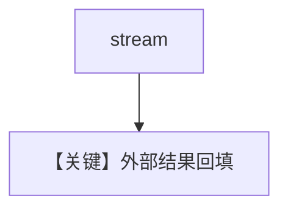

# external_tool_execution_stream.py — 实现原理分析

> 源文件：`cookbook/03_teams/20_human_in_the_loop/external_tool_execution_stream.py`

## 概述

`external_tool_execution` 的 **流式** 变体：chunk 流在等待外部结果时暂停，恢复后继续输出。

## Mermaid 流程图

## 关键源码文件索引

| 文件 | 作用 |
|------|------|
| `agno/team/_run.py` | 流式 + 外部 tool |
