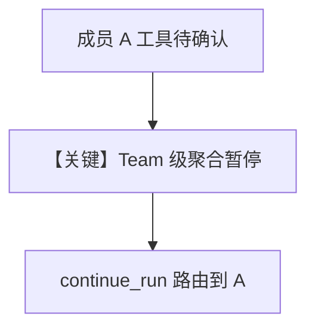

# team_tool_confirmation.py — 实现原理分析

<!-- cookbook-py-source:start -->
## 完整源码

```python
"""Team HITL: Tool on the team itself requiring confirmation.

This example demonstrates HITL for tools provided directly to the Team
(not to member agents). When the team leader decides to use a tool
that requires confirmation, the entire team run pauses until the
human confirms.
"""

from agno.agent import Agent
from agno.models.openai import OpenAIResponses
from agno.team.team import Team
from agno.tools import tool


# ---------------------------------------------------------------------------
# Tools
# ---------------------------------------------------------------------------
@tool(requires_confirmation=True)
def approve_deployment(environment: str, service: str) -> str:
    """Approve and execute a deployment to an environment.

    Args:
        environment (str): Target environment (staging, production)
        service (str): Service to deploy
    """
    return f"Deployment of {service} to {environment} approved and executed"


# ---------------------------------------------------------------------------
# Create Members
# ---------------------------------------------------------------------------
research_agent = Agent(
    name="Research Agent",
    role="Researches deployment readiness",
    model=OpenAIResponses(id="gpt-5-mini"),
)


# ---------------------------------------------------------------------------
# Create Team
# ---------------------------------------------------------------------------
team = Team(
    name="Release Team",
    members=[research_agent],
    model=OpenAIResponses(id="gpt-5-mini"),
    tools=[approve_deployment],
)


# ---------------------------------------------------------------------------
# Run Team
# ---------------------------------------------------------------------------
if __name__ == "__main__":
    response = team.run("Check if the auth service is ready and deploy it to staging")

    if response.is_paused:
        print("Team paused - requires confirmation for team-level tool")
        for req in response.requirements:
            if req.needs_confirmation:
                print(f"  Tool: {req.tool_execution.tool_name}")
                print(f"  Args: {req.tool_execution.tool_args}")
                req.confirm()

        response = team.continue_run(response)
        print(f"Result: {response.content}")
    else:
        print(f"Result: {response.content}")
```

<!-- cookbook-py-source:end -->

> 源文件：`cookbook/03_teams/20_human_in_the_loop/team_tool_confirmation.py`

## 概述

本示例强调 **Team 层对成员工具确认的呈现与路由**：多成员时暂停上下文包含 **member 标识**，用户确认后回到正确成员。

## Mermaid 流程图



## 关键源码文件索引

| 文件 | 作用 |
|------|------|
| `agno/team/_tools.py` | 成员暂停传播 |
