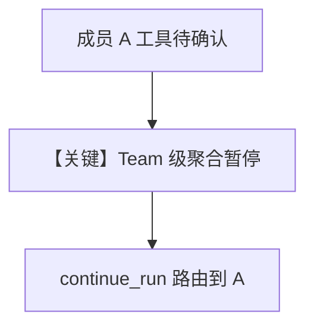

# team_tool_confirmation.py — 实现原理分析

> 源文件：`cookbook/03_teams/20_human_in_the_loop/team_tool_confirmation.py`

## 概述

本示例强调 **Team 层对成员工具确认的呈现与路由**：多成员时暂停上下文包含 **member 标识**，用户确认后回到正确成员。

## Mermaid 流程图

## 关键源码文件索引

| 文件 | 作用 |
|------|------|
| `agno/team/_tools.py` | 成员暂停传播 |
