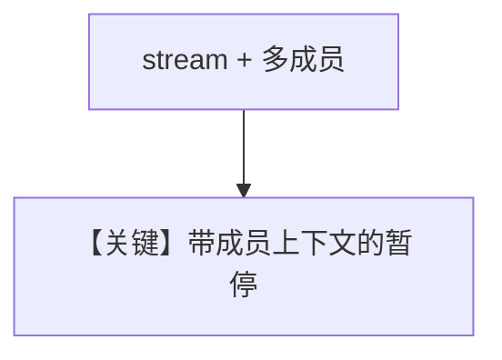

# team_tool_confirmation_stream.py — 实现原理分析

> 源文件：`cookbook/03_teams/20_human_in_the_loop/team_tool_confirmation_stream.py`

## 概述

`team_tool_confirmation` 的 **流式** 版本：多成员 + 流式事件下的确认与恢复。

## Mermaid 流程图

## 关键源码文件索引

| 文件 | 作用 |
|------|------|
| `agno/team/_run.py` | Team HITL 流式 |
