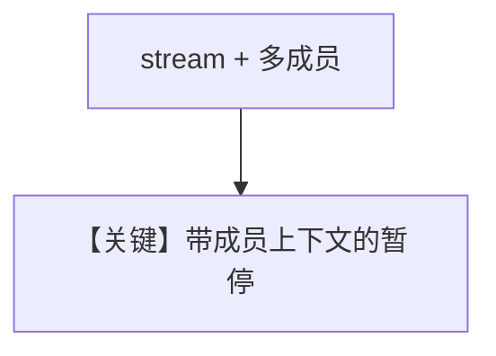

# team_tool_confirmation_stream.py — 实现原理分析

<!-- cookbook-py-source:start -->
## 完整源码

```python
"""Team HITL Streaming: Tool on the team itself requiring confirmation.

This example demonstrates HITL for tools provided directly to the Team
(not to member agents) in streaming mode. When the team leader decides
to use a tool that requires confirmation, the entire team run pauses
until the human confirms.

Note: For team-level tools (not member agent tools), you can use either
isinstance(event, TeamRunPausedEvent) or event.is_paused since there's
no member agent pause to confuse it with.
"""

from agno.agent import Agent
from agno.db.sqlite import SqliteDb
from agno.models.openai import OpenAIResponses
from agno.run.team import RunPausedEvent as TeamRunPausedEvent
from agno.team.team import Team
from agno.tools import tool
from agno.utils import pprint

# ---------------------------------------------------------------------------
# Setup
# ---------------------------------------------------------------------------
db = SqliteDb(db_file="tmp/team_hitl_stream.db")


# ---------------------------------------------------------------------------
# Tools
# ---------------------------------------------------------------------------
@tool(requires_confirmation=True)
def approve_deployment(environment: str, service: str) -> str:
    """Approve and execute a deployment to an environment.

    Args:
        environment (str): Target environment (staging, production)
        service (str): Service to deploy
    """
    return f"Deployment of {service} to {environment} approved and executed"


# ---------------------------------------------------------------------------
# Create Members
# ---------------------------------------------------------------------------
research_agent = Agent(
    name="Research Agent",
    role="Researches deployment readiness",
    model=OpenAIResponses(id="gpt-5-mini"),
    db=db,
)


# ---------------------------------------------------------------------------
# Create Team
# ---------------------------------------------------------------------------
team = Team(
    name="Release Team",
    members=[research_agent],
    model=OpenAIResponses(id="gpt-5-mini"),
    tools=[approve_deployment],
    db=db,
)


# ---------------------------------------------------------------------------
# Run Team
# ---------------------------------------------------------------------------
if __name__ == "__main__":
    for run_event in team.run(
        "Check if the auth service is ready and deploy it to staging", stream=True
    ):
        # Use isinstance to check for team's pause event
        if isinstance(run_event, TeamRunPausedEvent):
            print("Team paused - requires confirmation for team-level tool")
            for req in run_event.active_requirements:
                if req.needs_confirmation:
                    print(f"  Tool: {req.tool_execution.tool_name}")
                    print(f"  Args: {req.tool_execution.tool_args}")
                    req.confirm()

            response = team.continue_run(
                run_id=run_event.run_id,
                session_id=run_event.session_id,
                requirements=run_event.requirements,
                stream=True,
            )
            pprint.pprint_run_response(response)
```

<!-- cookbook-py-source:end -->

> 源文件：`cookbook/03_teams/20_human_in_the_loop/team_tool_confirmation_stream.py`

## 概述

`team_tool_confirmation` 的 **流式** 版本：多成员 + 流式事件下的确认与恢复。

## Mermaid 流程图



## 关键源码文件索引

| 文件 | 作用 |
|------|------|
| `agno/team/_run.py` | Team HITL 流式 |
