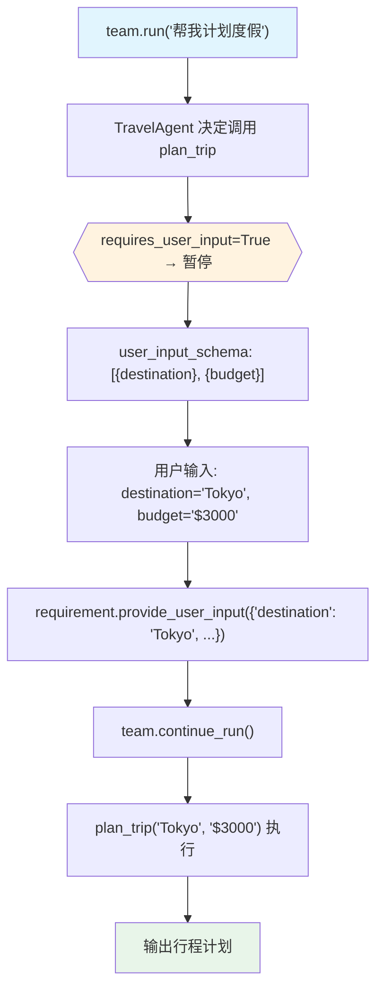

# user_input_required.py — 实现原理分析

> 源文件：`cookbook/03_teams/20_human_in_the_loop/user_input_required.py`

## 概述

本示例展示 **Team 级用户输入收集**：`@tool(requires_user_input=True, user_input_fields=["destination", "budget"])` 标记工具，成员调用时暂停，`requirement.user_input_schema` 提供需要收集的字段列表，用户填写后调用 `requirement.provide_user_input(values)` 注入，`team.continue_run()` 用真实值完成工具调用。

**核心配置一览：**

| 配置项 | 值 | 说明 |
|--------|------|------|
| `requires_user_input=True` | 工具装饰器参数 | 需要用户提供输入 |
| `user_input_fields` | `["destination", "budget"]` | 需收集的字段名 |
| `requirement.needs_user_input` | `bool` | 用户输入类型判断 |
| `requirement.user_input_schema` | `list[Field]` | 字段列表（含名称和默认值） |
| `requirement.provide_user_input(dict)` | 方法 | 注入用户提供的值 |

## 核心组件解析

### 工具声明

```python
@tool(requires_user_input=True, user_input_fields=["destination", "budget"])
def plan_trip(destination: str = "", budget: str = "") -> str:
    """Plan a trip based on user preferences."""
    return f"Trip planned to {destination} with a budget of {budget}..."
```

LLM 判断需要调用 `plan_trip` 但参数值需用户提供时暂停。

### 用户输入收集

```python
for requirement in run_response.active_requirements:
    if requirement.needs_user_input:
        values = {}
        for field in requirement.user_input_schema or []:
            values[field.name] = Prompt.ask(
                f"  {field.name}", 
                default=field.value or ""  # LLM 猜测的默认值
            )
        requirement.provide_user_input(values)
```

`field.value` 可能已包含 LLM 的猜测值，用户可直接确认或修改。

### 与确认模式的区别

| 模式 | 目的 | 用户操作 |
|------|------|---------|
| `requires_confirmation` | 批准/拒绝已知参数 | y/n |
| `requires_user_input` | 收集缺失参数值 | 填写具体值 |

## Mermaid 流程图



## 关键源码文件索引

| 文件 | 关键函数/类 | 作用 |
|------|------------|------|
| `agno/tools/__init__.py` | `@tool(requires_user_input=True, user_input_fields=...)` | 用户输入标记 |
| `agno/run/requirement.py` | `RunRequirement`, `provide_user_input()` | 需求处理 |
