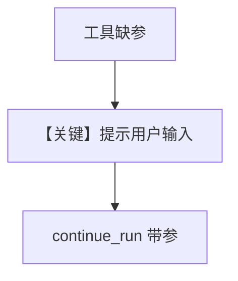

# user_input_required.py — 实现原理分析

<!-- cookbook-py-source:start -->
## 完整源码

```python
"""
User Input Required
=============================

Demonstrates collecting required user input during paused team tool execution.
"""

from agno.agent import Agent
from agno.db.sqlite import SqliteDb
from agno.models.openai import OpenAIResponses
from agno.team import Team
from agno.tools import tool
from agno.utils import pprint
from rich.console import Console
from rich.prompt import Prompt

# ---------------------------------------------------------------------------
# Setup
# ---------------------------------------------------------------------------
console = Console()

db = SqliteDb(session_table="team_user_input_sessions", db_file="tmp/team_hitl.db")


@tool(requires_user_input=True, user_input_fields=["destination", "budget"])
def plan_trip(destination: str = "", budget: str = "") -> str:
    """Plan a trip based on user preferences."""
    return (
        f"Trip planned to {destination} with a budget of {budget}. "
        "Includes flights, hotel, and activities."
    )


# ---------------------------------------------------------------------------
# Create Members
# ---------------------------------------------------------------------------
travel_agent = Agent(
    name="TravelAgent",
    model=OpenAIResponses(id="gpt-5-mini"),
    tools=[plan_trip],
    db=db,
    telemetry=False,
)

# ---------------------------------------------------------------------------
# Create Team
# ---------------------------------------------------------------------------
team = Team(
    name="TravelTeam",
    model=OpenAIResponses(id="gpt-5-mini"),
    members=[travel_agent],
    db=db,
    telemetry=False,
    add_history_to_context=True,
)

# ---------------------------------------------------------------------------
# Run Team
# ---------------------------------------------------------------------------
if __name__ == "__main__":
    session_id = "team_travel_session"
    run_response = team.run("Help me plan a vacation", session_id=session_id)

    if run_response.is_paused:
        console.print("[bold yellow]Team is paused - user input needed[/]")

        for requirement in run_response.active_requirements:
            if requirement.needs_user_input:
                console.print(
                    f"Member [bold cyan]{requirement.member_agent_name}[/] needs input for "
                    f"[bold blue]{requirement.tool_execution.tool_name}[/]"
                )

                values = {}
                for field in requirement.user_input_schema or []:
                    values[field.name] = Prompt.ask(
                        f"  {field.name}", default=field.value or ""
                    )
                requirement.provide_user_input(values)

        run_response = team.continue_run(run_response)

    pprint.pprint_run_response(run_response)
```

<!-- cookbook-py-source:end -->

> 源文件：`cookbook/03_teams/20_human_in_the_loop/user_input_required.py`

## 概述

本示例展示 **`user_input` 类 RunRequirement**（与 confirmation 不同）：工具需要用户 **输入参数**（如目的地、预算）才能继续，终端 `Prompt` 收集后 `continue_run`。

## Mermaid 流程图


```mermaid
flowchart TD
    U["工具缺参"] --> I["【关键】提示用户输入"]
    I --> C["continue_run 带参"]
```

## 关键源码文件索引

| 文件 | 作用 |
|------|------|
| `agno/tools/` | `user_input` 工具标记 |
