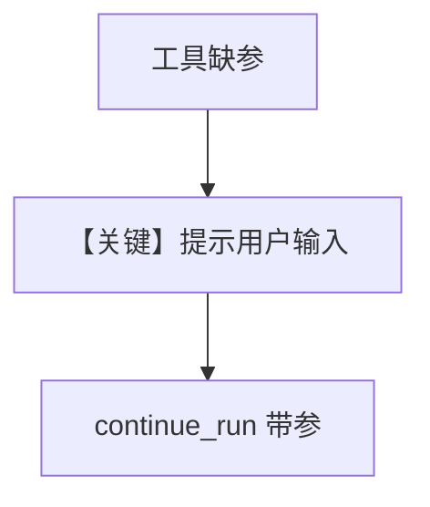

# user_input_required.py — 实现原理分析

> 源文件：`cookbook/03_teams/20_human_in_the_loop/user_input_required.py`

## 概述

本示例展示 **`user_input` 类 RunRequirement**（与 confirmation 不同）：工具需要用户 **输入参数**（如目的地、预算）才能继续，终端 `Prompt` 收集后 `continue_run`。

## Mermaid 流程图

```mermaid
flowchart TD
    U["工具缺参"] --> I["【关键】提示用户输入"]
    I --> C["continue_run 带参"]
```

## 关键源码文件索引

| 文件 | 作用 |
|------|------|
| `agno/tools/` | `user_input` 工具标记 |
