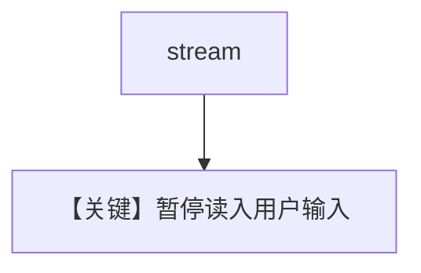

# user_input_required_stream.py — 实现原理分析

> 源文件：`cookbook/03_teams/20_human_in_the_loop/user_input_required_stream.py`

## 概述

`user_input_required` 的 **流式** 变体：在 async 流中暂停并等待终端输入，再继续生成。

## Mermaid 流程图

## 关键源码文件索引

| 文件 | 作用 |
|------|------|
| `agno/team/_run.py` | 流式暂停 |
