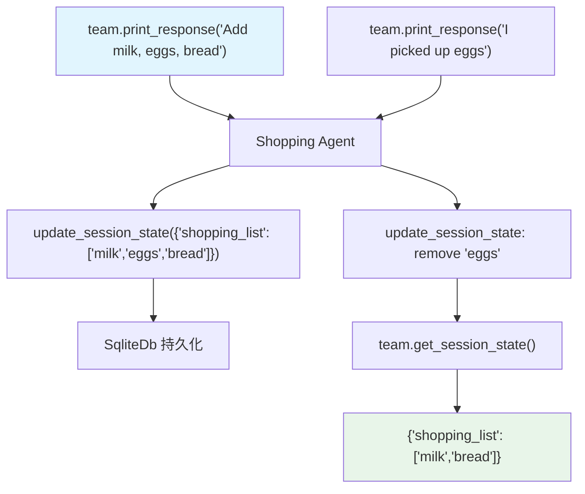

# agentic_session_state.py — 实现原理分析

> 源文件：`cookbook/03_teams/21_state/agentic_session_state.py`

## 概述

本示例展示 **`enable_agentic_state=True`**：Team 和成员 Agent 均启用此配置，LLM 可以通过工具调用（`update_session_state`）主动读写 `session_state`。初始状态 `{"shopping_list": []}` 在多轮对话中由 LLM 自主维护，`team.get_session_state()` 可随时查看当前状态。

**核心配置一览：**

| 配置项 | 值 | 说明 |
|--------|------|------|
| `enable_agentic_state` | `True` | LLM 可主动操作 session_state |
| `session_state` | `{"shopping_list": []}` | 初始状态 |
| `add_session_state_to_context` | `True` | 状态注入上下文（只读可见） |
| `team.get_session_state()` | 方法 | 获取当前状态 |

## 核心组件解析

### Agentic State vs 静态 State

| 配置 | LLM 行为 | 适用场景 |
|------|---------|---------|
| `add_session_state_to_context=True`（无 agentic） | 只读，感知状态 | 个性化响应 |
| `enable_agentic_state=True` | 可读写，主动更新 | 有状态工作流 |

### 工作流示例

```
第1轮: "Add milk, eggs, bread"
  → Shopping Agent 调用 update_session_state
  → session_state: {"shopping_list": ["milk", "eggs", "bread"]}

第2轮: "I picked up the eggs"
  → Shopping Agent 更新 session_state
  → session_state: {"shopping_list": ["milk", "bread"]}

team.get_session_state()  # → {"shopping_list": ["milk", "bread"]}
```

### Team + Member 共同 enable

```python
shopping_agent = Agent(
    db=db,
    add_session_state_to_context=True,
    enable_agentic_state=True,  # 成员也能更新状态
)

team = Team(
    session_state={"shopping_list": []},
    db=db,
    add_session_state_to_context=True,
    enable_agentic_state=True,  # 状态在 Team 层管理
)
```

Team 和成员共享同一 `db`，状态通过数据库同步。

## Mermaid 流程图



## 关键源码文件索引

| 文件 | 关键函数/类 | 作用 |
|------|------------|------|
| `agno/team/team.py` | `enable_agentic_state`, `session_state`, `get_session_state()` | Agentic 状态管理 |
