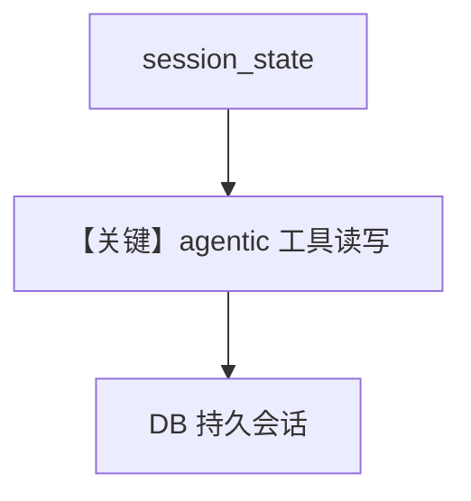

# agentic_session_state.py — 实现原理分析

<!-- cookbook-py-source:start -->
## 完整源码

```python
"""
Agentic Session State
=====================

Demonstrates team and member agentic state updates on shared session state.
"""

from agno.agent import Agent
from agno.db.sqlite import SqliteDb
from agno.models.openai import OpenAIResponses
from agno.team import Team

# ---------------------------------------------------------------------------
# Setup
# ---------------------------------------------------------------------------
db = SqliteDb(db_file="tmp/agents.db")

# ---------------------------------------------------------------------------
# Create Members
# ---------------------------------------------------------------------------
shopping_agent = Agent(
    name="Shopping List Agent",
    role="Manage the shopping list",
    model=OpenAIResponses(id="gpt-5-mini"),
    db=db,
    add_session_state_to_context=True,
    enable_agentic_state=True,
)

# ---------------------------------------------------------------------------
# Create Team
# ---------------------------------------------------------------------------
team = Team(
    members=[shopping_agent],
    session_state={"shopping_list": []},
    db=db,
    add_session_state_to_context=True,
    enable_agentic_state=True,
    description="You are a team that manages a shopping list and chores",
    show_members_responses=True,
)

# ---------------------------------------------------------------------------
# Run Team
# ---------------------------------------------------------------------------
if __name__ == "__main__":
    team.print_response("Add milk, eggs, and bread to the shopping list")
    team.print_response("I picked up the eggs, now what's on my list?")
    print(f"Session state: {team.get_session_state()}")
```

<!-- cookbook-py-source:end -->

> 源文件：`cookbook/03_teams/21_state/agentic_session_state.py`

## 概述

本示例展示 **`enable_agentic_state=True` + `add_session_state_to_context=True`**：Team 与成员共享 `session_state`（如 `shopping_list`），模型可通过框架提供的 **agentic 状态工具** 读写列表。

**核心配置一览：**

| 配置项 | 值 |
|--------|-----|
| `session_state` | `{"shopping_list": []}` |
| `enable_agentic_state` | `True`（Team 与 shopping_agent） |
| `db` | `SqliteDb(tmp/agents.db)` |

## 运行机制与因果链

状态在 run 间持久化（同 session）；`get_session_state()` 打印最终 dict。

## System Prompt 组装

`<session_state>` 段在 `add_session_state_to_context` 时进入 system（`agno/team/_messages.py` `_get_formatted_session_state_for_system_message`）。

## Mermaid 流程图


```mermaid
flowchart TD
    S["session_state"] --> A["【关键】agentic 工具读写"]
    A --> D["DB 持久会话"]
```

## 关键源码文件索引

| 文件 | 作用 |
|------|------|
| `agno/team/_messages.py` | session_state 注入 |
