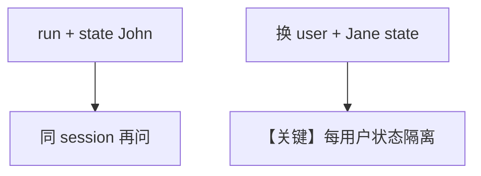

# change_state_on_run.py — 实现原理分析

<!-- cookbook-py-source:start -->
## 完整源码

```python
"""
Change State On Run
===================

Demonstrates per-run session state overrides for different users/sessions.
"""

from agno.db.in_memory import InMemoryDb
from agno.models.openai import OpenAIResponses
from agno.team import Team

# ---------------------------------------------------------------------------
# Create Team
# ---------------------------------------------------------------------------
team = Team(
    db=InMemoryDb(),
    model=OpenAIResponses(id="gpt-5.2"),
    members=[],
    instructions="Users name is {user_name} and age is {age}",
)

# ---------------------------------------------------------------------------
# Run Team
# ---------------------------------------------------------------------------
if __name__ == "__main__":
    team.print_response(
        "What is my name?",
        session_id="user_1_session_1",
        user_id="user_1",
        session_state={"user_name": "John", "age": 30},
    )

    team.print_response(
        "How old am I?",
        session_id="user_1_session_1",
        user_id="user_1",
    )

    team.print_response(
        "What is my name?",
        session_id="user_2_session_1",
        user_id="user_2",
        session_state={"user_name": "Jane", "age": 25},
    )

    team.print_response(
        "How old am I?",
        session_id="user_2_session_1",
        user_id="user_2",
    )
```

<!-- cookbook-py-source:end -->

> 源文件：`cookbook/03_teams/21_state/change_state_on_run.py`

## 概述

本示例展示 **每次 `print_response` 传入不同 `session_state`**（配合 `session_id`/`user_id`）实现 **多用户隔离** 与 **逐轮覆盖**：`instructions` 中 `{user_name}`、`{age}` 由 resolve 注入。

**核心配置一览：**

| 配置项 | 值 |
|--------|-----|
| `db` | `InMemoryDb()` |
| `instructions` | `"Users name is {user_name} and age is {age}"` |
| `members` | `[]` |

## 运行机制与因果链

同一 `session_id` 第二轮不传 `session_state` 时依赖存储中的状态（见 `.py` 行为）。

## Mermaid 流程图



## 关键源码文件索引

| 文件 | 作用 |
|------|------|
| `agno/team/_messages.py` | `_format_message_with_state_variables` |
