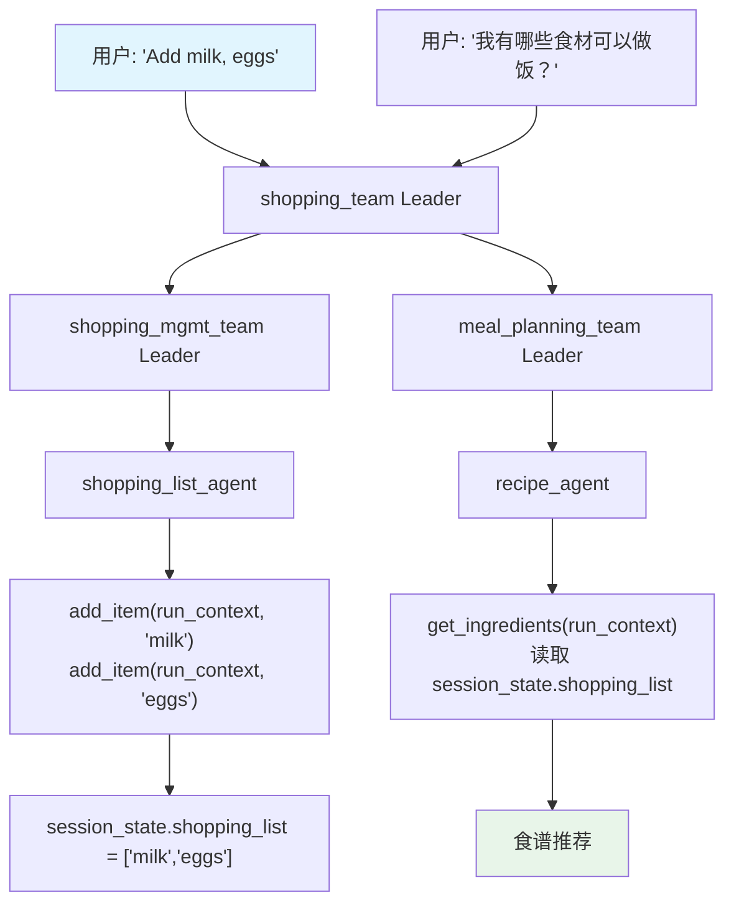

# nested_shared_state.py — 实现原理分析

> 源文件：`cookbook/03_teams/21_state/nested_shared_state.py`

## 概述

本示例展示 **嵌套 Team 的共享 `session_state`**：顶层 `shopping_team` 管理 `{"shopping_list": [], "chores": []}`，其成员是两个子 Team（`shopping_mgmt_team`、`meal_planning_team`）。工具函数通过 `run_context: RunContext` 注入参数直接读写顶层的 `session_state`，实现跨层级状态共享。

**核心配置一览：**

| 层级 | 组件 | 作用 |
|------|------|------|
| 顶层 Team | `shopping_team` | 拥有 `session_state`，协调子 Team |
| 子 Team 1 | `shopping_mgmt_team` | 管理购物清单 |
| 子 Team 2 | `meal_planning_team` | 食谱推荐 |
| 工具函数 | `add_item`, `remove_item`, `get_ingredients`... | 直接操作 `run_context.session_state` |

## 核心组件解析

### 工具函数直接操作 session_state

```python
def add_item(run_context: RunContext, item: str) -> str:
    # run_context.session_state 是顶层 Team 的状态
    run_context.session_state["shopping_list"].append(item)
    return f"Added '{item}' to the shopping list"
```

无论工具挂载在哪个层级，`run_context.session_state` 都指向同一个状态对象。

### 两层子 Team 结构

```
shopping_team（顶层，拥有 session_state）
  ├── shopping_mgmt_team（子 Team 1）
  │     └── shopping_list_agent（成员）→ add_item/remove_item
  └── meal_planning_team（子 Team 2）
        └── recipe_agent（成员）→ get_ingredients
```

### `team.get_session_state()` 追踪状态

```python
shopping_team.print_response("Add milk, eggs, and bread...")
print(f"Session state: {shopping_team.get_session_state()}")
# → {"shopping_list": ["milk", "eggs", "bread"], "chores": [...]}
```

## Mermaid 流程图



## 关键源码文件索引

| 文件 | 关键函数/类 | 作用 |
|------|------------|------|
| `agno/run/context.py` | `RunContext.session_state` | 运行时状态访问 |
| `agno/team/team.py` | `session_state`, `get_session_state()` | 状态管理 |
